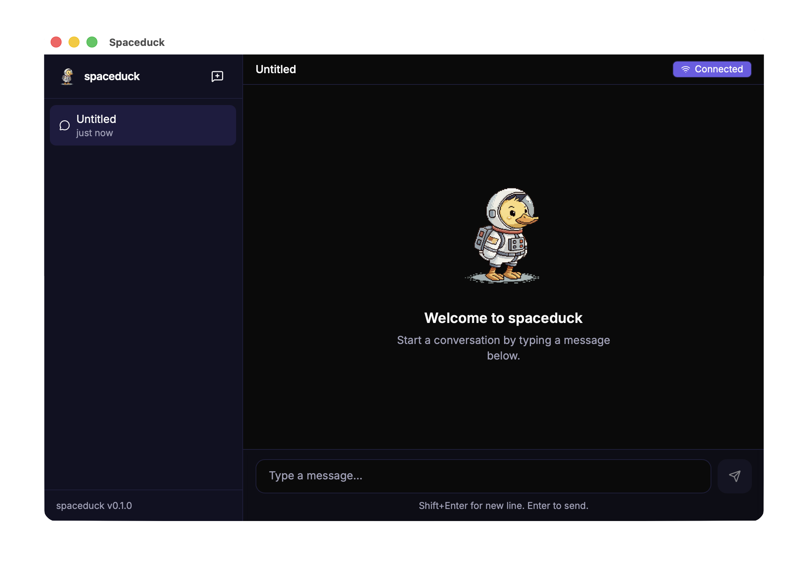

<p align="center">
  
</p>

<p align="center">
  <strong>A tiny space duck. A big mission. Your new co-pilot has feathers.</strong>
</p>

<p align="center">
  <a href="https://spaceduck.mintlify.app">Docs</a> ·
  <a href="https://github.com/maziarzamani/spaceduck/issues">Issues</a> ·
  <a href="https://github.com/maziarzamani/spaceduck/discussions">Discussions</a>
</p>

<p align="center">
  
  
  
  
</p>

> [!WARNING]
> **Experimental — APIs and storage may change before v1.0.**

---

## What is Spaceduck?

Spaceduck is a personal AI assistant you run on your own machine. It remembers what you tell it across conversations, browses the web and reads documents on your behalf, and lets you swap between local and cloud models without restarting.

No agent frameworks, no orchestration wrappers — every layer is handwritten TypeScript.

<p align="center">
  
</p>

## Quickstart

```bash
git clone https://github.com/maziarzamani/spaceduck.git
cd spaceduck
bun install
bun run dev
```

Open [http://localhost:3000](http://localhost:3000) → **Settings** → pick a chat model provider → start chatting.

**Optional:** enable semantic memory recall in **Settings > Memory** by toggling on Semantic recall and configuring an embedding model.

> Full setup guide with platform-specific steps: [Docs → Quickstart](https://spaceduck.mintlify.app/quickstart)

## Model Providers

Spaceduck supports both local and cloud providers. Chat and embeddings are independent — mix and match.

**Local**
- [llama.cpp](https://spaceduck.mintlify.app/providers/llamacpp) — llama-server, full control, any GGUF model
- [LM Studio](https://spaceduck.mintlify.app/providers/lmstudio) — GUI-based, built-in model browser

**Cloud**
- [AWS Bedrock](https://spaceduck.mintlify.app/providers/bedrock) — Nova, Claude, Titan embeddings
- [Google Gemini](https://spaceduck.mintlify.app/providers/gemini) — chat + embeddings, generous free tier
- [OpenRouter](https://spaceduck.mintlify.app/providers/openrouter) — hundreds of models, one API key

> Provider setup guides: [Docs → Model Providers](https://spaceduck.mintlify.app/providers/overview)

## Why Spaceduck

- **Persistent memory** — facts extracted from every conversation, recalled via hybrid vector + keyword search
- **Corrections win** — say "my name is now Peter" and the old name is automatically deactivated
- **Contamination guard** — the assistant can never overwrite your identity
- **Tool use** — web search, browser automation, document scanning, HTTP fetch
- **Multiple clients** — Web UI, Desktop (Tauri), CLI, WhatsApp
- **Hot-swap providers** — change models at runtime from the Settings UI or CLI
- **Two-server pattern** — run chat and embeddings on separate endpoints (local, cloud, or mixed)
- **Zero dependencies** — no LangChain, no LlamaIndex, no hidden abstractions

> Deep dive: [Docs → Memory Search](https://spaceduck.mintlify.app/concepts/memory-search)

## Platforms

| Platform | What it does |
|----------|-------------|
| **Gateway** | Local HTTP/WebSocket server — the engine that runs everything |
| **Web UI** | React chat with streaming, settings, file upload, voice dictation |
| **Desktop** | Tauri v2 native app with gateway sidecar (macOS, Linux, Windows) |
| **CLI** | `spaceduck status`, `config get/set`, `secret set/unset` |

> Details: [Docs → Platforms](https://spaceduck.mintlify.app/platforms/gateway)

## Tools

| Tool | What it does |
|------|-------------|
| **Web Search** | Brave, Perplexity Sonar, or SearXNG |
| **Browser** | Playwright headless with accessibility snapshots |
| **Web Fetch** | HTTP fetch + HTML-to-text |
| **Document Scan** | PDF-to-markdown via [Marker](https://github.com/VikParuchuri/marker) |
| **Voice Input** | Speech-to-text via [Whisper](https://github.com/openai/whisper) |

> Setup guides: [Docs → Tools](https://spaceduck.mintlify.app/tools/overview)

## Development

```bash
bun test --recursive     # Run all tests
bun run dev              # Dev server with hot reload
bun run dev:desktop      # Desktop app + gateway
```

> Test suites, project structure, and contributing guidelines: [Docs → Reference](https://spaceduck.mintlify.app/reference/common-errors)

## Roadmap

Tracked in the [docs](https://spaceduck.mintlify.app) and [GitHub Issues](https://github.com/maziarzamani/spaceduck/issues). Top priorities:

1. **Per-user isolation** — scope memory by user identity across channels
2. **Provider fallback chain** — auto-retry with a secondary provider
3. **Memory inspector** — Web UI to browse, edit, and delete stored facts

---

<p align="center">
  <sub>
    Built with patience and curiosity. Spaceduck is a personal project — not a product, not a startup.
    Just a duck in a spacesuit, trying to be helpful.
  </sub>
</p>
