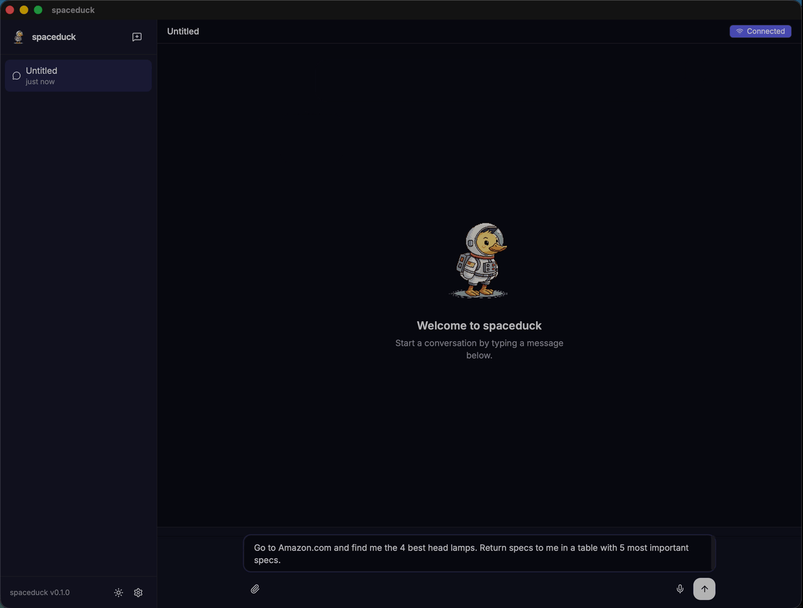

<p align="center">
  
</p>

<p align="center">
  <strong>A tiny space duck. A big mission. Your new co-pilot has feathers.</strong>
</p>

<p align="center">
  <a href="https://spaceduck.ai">Website</a> ·
  <a href="https://docs.spaceduck.ai">Docs</a> ·
  <a href="https://github.com/maziarzamani/spaceduck/issues">Issues</a> ·
  <a href="https://github.com/maziarzamani/spaceduck/discussions">Discussions</a>
</p>

<p align="center">
  
  
  
  
</p>

> [!WARNING]
> **Experimental — Breaking changes before v1.0.**

---

## What is Spaceduck?

Spaceduck is a personal AI assistant you run on your own machine. It remembers what you tell it across conversations, browses the web and reads documents on your behalf, and lets you swap between local and cloud models without restarting.

No agent frameworks, no orchestration wrappers — every layer is handwritten TypeScript.

<p align="center">
  
</p>

## Install

### Installer (recommended)

```bash
curl -fsSL https://spaceduck.ai/install.sh | bash
```

On Windows: `irm https://spaceduck.ai/install.ps1 | iex`

> Full installer docs: [Docs → Installer](https://docs.spaceduck.ai/install/installer)

### Docker

```bash
docker compose up --build -d
```

Data persists in the `spaceduck-data` volume across restarts and upgrades.

> Full Docker guide: [Docs → Docker](https://docs.spaceduck.ai/install/docker)

### From source

```bash
git clone https://github.com/maziarzamani/spaceduck.git
cd spaceduck
bun install
bun run dev
```

> Full source build guide: [Docs → From Source](https://docs.spaceduck.ai/install/from-source)

---

Open [http://localhost:3000](http://localhost:3000) → **Settings** → pick a chat model provider → start chatting.

**Optional:** enable semantic memory recall in **Settings > Memory** by toggling on Semantic recall and configuring an embedding model.

## Model Providers

Spaceduck supports both local and cloud providers. Chat and embeddings are independent — mix and match.

**Local**
- [llama.cpp](https://docs.spaceduck.ai/providers/llamacpp) — llama-server, full control, any GGUF model
- [LM Studio](https://docs.spaceduck.ai/providers/lmstudio) — GUI-based, built-in model browser

**Cloud**
- [AWS Bedrock](https://docs.spaceduck.ai/providers/bedrock) — Nova, Claude, Titan embeddings
- [Google Gemini](https://docs.spaceduck.ai/providers/gemini) — chat + embeddings, generous free tier
- [OpenRouter](https://docs.spaceduck.ai/providers/openrouter) — hundreds of models, one API key

> Provider setup guides: [Docs → Model Providers](https://docs.spaceduck.ai/providers/overview)

## Why Spaceduck

- **Persistent memory** — facts extracted from every conversation, recalled via hybrid vector + keyword search
- **Corrections win** — say "my name is now Peter" and the old name is automatically deactivated
- **Contamination guard** — the assistant can never overwrite your identity
- **Tool use** — web search, browser automation, document scanning, HTTP fetch
- **Multiple clients** — Web UI, Desktop (Tauri), CLI, WhatsApp
- **Hot-swap providers** — change models at runtime from the Settings UI or CLI
- **Two-server pattern** — run chat and embeddings on separate endpoints (local, cloud, or mixed)
- **Zero dependencies** — no LangChain, no LlamaIndex, no hidden abstractions

> Deep dive: [Docs → Memory Search](https://docs.spaceduck.ai/concepts/memory-search)

## Platforms

| Platform | What it does |
|----------|-------------|
| **Gateway** | Local HTTP/WebSocket server — the engine that runs everything |
| **Web UI** | React chat with streaming, settings, file upload, voice dictation |
| **Desktop** | Tauri v2 native app with gateway sidecar (macOS, Linux, Windows) |
| **CLI** | `spaceduck status`, `config get/set`, `secret set/unset` |
| **WhatsApp** | Messaging via QR-code pairing (Baileys) |

> Details: [Docs → Platforms](https://docs.spaceduck.ai/platforms/gateway)

## macOS Permissions (Desktop)

The Desktop app uses a system-wide Fn (Globe) key listener for dictation. macOS requires two permissions for this to work:

| Permission | Where to enable | Why |
|---|---|---|
| **Accessibility** | System Settings → Privacy & Security → Accessibility | Allows the app to observe keyboard events and simulate paste (Cmd+V) |
| **Input Monitoring** | System Settings → Privacy & Security → Input Monitoring | Required for HID-level event tap to intercept the Fn/Globe key before macOS routes it to the emoji picker |

Both permissions must be granted to the Spaceduck app (or the terminal running it during development). You will be prompted on first launch, or you can add the app manually in System Settings.

## Tools

| Tool | What it does |
|------|-------------|
| **Web Search** | Brave, Perplexity Sonar, or SearXNG |
| **Browser** | Playwright headless with accessibility snapshots (per-conversation sessions) |
| **Web Fetch** | HTTP fetch + HTML-to-text |
| **Document Scan** | PDF-to-markdown via [Marker](https://github.com/VikParuchuri/marker) |
| **Voice Input** | Speech-to-text via [Whisper](https://github.com/openai/whisper) |

> Setup guides: [Docs → Tools](https://docs.spaceduck.ai/tools/overview)

### Browser sessions

Each conversation gets its own isolated Chromium browser. Sessions are created on first `browser_navigate` and automatically close after an idle timeout (no browser tool calls).

| Config path | Default | Description |
|---|---|---|
| `tools.browser.enabled` | `true` | Enable/disable all browser tools |
| `tools.browser.livePreview` | `false` | Stream live screenshots to the UI |
| `tools.browser.sessionIdleTimeoutMs` | `600000` (10 min) | Idle timeout before auto-closing a session. `0` = close immediately after each agent run. |
| `tools.browser.maxSessions` | `null` (unlimited) | Max concurrent browser sessions. When the limit is reached, the oldest idle session is evicted. |

Configure via CLI:

```bash
spaceduck config set /tools/browser/sessionIdleTimeoutMs 300000
spaceduck config set /tools/browser/maxSessions 3
```

All browser settings are hot-appliable — no gateway restart required.

## Development

Spaceduck is a Bun monorepo. Core logic lives in `packages/` (core, gateway, config, providers, memory, tools, channels) and applications live in `apps/` (web, desktop, CLI, website).

```bash
bun install                # Install all workspace dependencies
bun run dev                # Dev server with hot reload
bun run dev:desktop        # Desktop app + gateway
```

### Testing

```bash
bun test --recursive       # All tests
bun run test:unit          # Core unit tests
bun run test:e2e           # End-to-end gateway tests
bun run test:coverage      # Coverage report
bash scripts/smoke-docker.sh  # Docker build + smoke test
```

> Test suites, project structure, and contributing guidelines: [Docs → Reference](https://docs.spaceduck.ai/reference/common-errors)

## Roadmap

Tracked in [GitHub Issues](https://github.com/maziarzamani/spaceduck/issues).

**Shipped**
- Budget-aware task scheduler with persistent queue and session lanes
- Per-task and global budget enforcement (tokens, cost, tool calls, memory writes)
- Cache-aware pricing, universal injection detection, memory isolation hardening

**In progress**
- Skill runtime (SKILL.md parser, sandboxed execution, security scanner)

**Up next**
- Skill marketplace (registry, trust scoring, install/uninstall)
- Per-user isolation across channels
- Provider fallback chain
- Memory inspector UI

---

<p align="center">
  <sub>
    Built with patience and curiosity. Spaceduck is a personal project — not a product, not a startup.
    Just a duck in a spacesuit, trying to be helpful.
  </sub>
</p>
