<p align="center">
  
</p>

<p align="center">
  <strong>A tiny space duck. A big mission. Your new co-pilot has feathers.</strong>
</p>

<p align="center">
  
  
  
  
</p>

> [!WARNING]
> **This project is experimental and under active development.**
> The API, configuration format, database schema, and memory architecture may change without notice between versions.
> Breaking changes are expected before v1.0 — including a planned replacement of the current `.env` configuration
> with a structured config file. Use in production at your own risk.

---

**Spaceduck** runs locally and turns chat into actions. It remembers what you tell it using semantic memory (vector embeddings with FTS fallback), streams replies to a WebSocket UI, and can browse the web and run tools on your behalf.

Built from scratch with no agent frameworks or orchestration wrappers. Core layers (context management, vector memory, fact extraction, provider abstraction, streaming protocol) are handwritten in TypeScript on Bun. Swap chat models and embedding models via environment variables.

## Status

### Core

| Component | | Details |
|-----------|---|---------|
| Types & contracts | ✅ | `Message`, `Provider`, `EmbeddingProvider`, `ConversationStore`, `LongTermMemory`, `Result<T>` monad |
| Context builder | ✅ | Token budgeting, system prompt injection, LTM fact recall, auto-compaction, afterTurn eager flush |
| Agent loop | ✅ | Multi-round tool execution with automatic tool → result → LLM cycles |
| Event bus | ✅ | Typed fire-and-forget + async emit, powers fact extraction pipeline |

### Memory

| Component | | Details |
|-----------|---|---------|
| Conversation store | ✅ | Full message history in SQLite with WAL mode |
| Long-term facts | ✅ | Durable personal facts with FTS5 full-text search |
| Vector embeddings | ✅ | sqlite-vec cosine similarity, configurable dimensions, `minScore` filtering, FTS5 fallback |
| Fact extraction | ✅ | LLM-based with hardened JSON parsing, regex fallback, afterTurn eager flush |
| Deduplication | ✅ | SHA-256 content hashing for exact duplicates |
| Hybrid recall | ✅ | RRF combining vector cosine + FTS5 BM25, recency decay, SQL expiry pushdown |

### Providers

| Component | | Details |
|-----------|---|---------|
| Provider interface | ✅ | Pluggable `Provider` and `EmbeddingProvider` contracts — bring any model |
| Gemini | ✅ | Chat streaming + embeddings via Google AI |
| LM Studio | ✅ | Chat streaming + embeddings via OpenAI-compatible API (any local model) |
| OpenRouter | ✅ | Multi-model chat streaming (access to hundreds of models) |
| AWS Bedrock | ✅ | Native Converse API (required for Nova), Titan Text Embeddings V2, Bearer token auth |
| Embedding factory | ✅ | Provider-agnostic creation from env config, fail-fast dimension validation |

### Channels & Interface

| Component | | Details |
|-----------|---|---------|
| Web UI | ✅ | React chat with streaming, conversations sidebar, Tailwind CSS |
| Gateway | ✅ | Bun HTTP + WebSocket server, session management, run locking |
| WhatsApp | ✅ | Baileys (WhatsApp Web protocol), QR pairing, typing indicators |
| Discord | 🔜 | Discord bot channel |
| Telegram | 🔜 | Telegram bot channel |
| CLI | 🔜 | Terminal-based chat interface |

### Tools

| Component | | Details |
|-----------|---|---------|
| Browser | ✅ | Playwright headless with accessibility snapshot refs |
| Web fetch | ✅ | HTTP fetch + HTML-to-text conversion |
| Web search | 🔜 | Brave Search API integration |
| Scheduler | 🔜 | Periodic web monitoring with natural language conditions |

## What it does today

- Chat via a streaming Web UI (WebSocket, token-by-token)
- Remember durable facts across conversations — recalled by hybrid vector + keyword search
- Eager fact extraction after every response via `afterTurn()` — no waiting for compaction
- Browse pages with Playwright and summarize or extract content
- Run tools inside an agent loop and return structured results
- Chat over WhatsApp (Baileys, QR pairing, typing indicators)

## Architecture

```mermaid
graph TD
    UI["Web UI (React)<br/>WebSocket + streaming deltas"]
    WA["WhatsApp (Baileys)<br/>QR pairing · typing indicators"]
    GW["Gateway (Bun)<br/>HTTP server · WS handler · sessions"]
    AL["Agent Loop<br/>+ tool cycles"]
    CB["Context Builder<br/>+ budget · compact"]
    MEM["Memory (SQLite)<br/>conversations · facts<br/>vector embeddings (vec0)<br/>FTS5 search · SHA-256 dedup"]
    CP["Chat Provider<br/>(pluggable)<br/>streaming chunks"]
    EP["Embedding Provider<br/>(pluggable)<br/>configurable dimensions"]
    TOOLS["Tools<br/>browser · fetch<br/>(extensible)"]

    UI --> GW
    WA --> GW
    GW --> AL
    GW --> CB
    GW --> MEM
    AL --> CP
    AL --> TOOLS
    MEM --> EP
```



## Memory System

Spaceduck has a three-tier memory architecture:

1. **Short-term** — Full conversation message history in SQLite, with token-budgeted context windows and automatic compaction.

2. **Long-term (facts)** — Durable personal facts extracted from conversations. Extracted eagerly after every turn via `afterTurn()` (not only at compaction), and stored with SHA-256 content hashes for exact deduplication. A memory firewall (`guardFact`) validates facts before storage, rejecting questions and noisy content.

3. **Vector embeddings** — Every fact is embedded via a configurable `EmbeddingProvider` and stored in a sqlite-vec virtual table. Recall uses hybrid scoring: Reciprocal Rank Fusion (RRF) combining vector cosine similarity and FTS5 BM25, with exponential recency decay and SQL-level expiry filtering.

```mermaid
flowchart TD
    A["User message → Agent Loop → Assistant response"]
    B["afterTurn() eager flush<br/>(background, every response)"]
    C["LLM extracts personal facts"]
    D["guardFact() → remember()<br/>SHA-256 dedup → embed()<br/>→ store in facts + vec_facts"]
    E["recall(topic, topK, strategy)"]
    F["Hybrid: RRF(vector + FTS5)<br/>+ recency decay + expiry filter"]
    G["FTS5-only fallback<br/>(when embeddings disabled)"]

    A --> B --> C --> D
    D -->|"On next query"| E
    E --> F
    E --> G
```



## Project Structure

```
spaceduck/
├── packages/
│   ├── core/                  # Zero-dep contracts + logic
│   │   └── src/
│   │       ├── types/         # Message, Provider, EmbeddingProvider, Memory, Errors
│   │       ├── agent.ts       # AgentLoop orchestrator with multi-round tool calling
│   │       ├── context-builder.ts  # Token budget, compaction, afterTurn eager flush
│   │       ├── fact-extractor.ts   # LLM-based fact extraction + guardFact firewall
│   │       ├── events.ts      # Typed EventBus (fire-and-forget + async)
│   │       └── config.ts
│   ├── providers/             # Pluggable — add your own by implementing Provider interface
│   │   ├── gemini/            # Google AI (chat + embeddings)
│   │   ├── bedrock/           # Amazon Bedrock (native Converse API + Titan V2 embeddings)
│   │   ├── lmstudio/          # Local models via OpenAI-compatible API
│   │   └── openrouter/        # Multi-model gateway
│   ├── memory/
│   │   └── sqlite/            # SQLite + FTS5 + sqlite-vec vector storage
│   │       └── src/
│   │           ├── schema.ts      # Migrations + ensureCustomSQLite()
│   │           ├── long-term.ts   # Hybrid recall (RRF) + vector + FTS + dedup
│   │           └── migrations/    # 001–007 SQL migrations
│   ├── channels/
│   │   ├── web/               # React web UI + WebSocket
│   │   └── whatsapp/          # WhatsApp via Baileys (QR pairing)
│   ├── gateway/               # Composition root — wires everything
│   │   └── src/
│   │       ├── gateway.ts         # HTTP/WS server + dependency injection
│   │       └── embedding-factory.ts  # Provider-agnostic embedding creation
│   └── tools/
│       ├── browser/           # Playwright headless browser
│       └── web-fetch/         # HTTP fetch + HTML-to-text
└── package.json               # Bun workspace root
```

## Quick Start

**Prerequisites:** [Bun](https://bun.sh) (v1.3+), an LLM provider (local or cloud)

```bash
# Clone and install
git clone https://github.com/maziarzamani/spaceduck.git
cd spaceduck
bun install

# For the browser tool (one-time)
bunx playwright install chromium

# For sqlite-vec on macOS — install SQLite with extension support (one-time)
brew install sqlite

# Configure
cp .env.example .env
# Edit .env — set your provider and API keys (see .env.example for all options)

# Run
bun run dev
# Open http://localhost:3000
```

### Embedding Setup

Vector memory requires an embedding model. The default `.env.example` is configured for Amazon Bedrock (Titan V2):

```env
EMBEDDING_PROVIDER=bedrock                         # or gemini, lmstudio
EMBEDDING_MODEL=amazon.titan-embed-text-v2:0       # Titan V2: 100+ languages
EMBEDDING_DIMENSIONS=1024                          # Titan V2 supports 256 | 512 | 1024
```

To disable vector search entirely and use FTS5 keyword search only: `EMBEDDING_ENABLED=false`

See `.env.example` for all available configuration options.

## Development

```bash
# Run all tests
bun test --recursive

# Run specific test suites
bun test packages/core/              # Unit tests (agent, context, events, facts)
bun test packages/memory/            # Memory + vector embedding tests
bun test packages/tools/browser/     # Browser tool tests
bun test packages/tools/web-fetch/   # Web-fetch tests

# Live E2E tests against Bedrock (requires AWS_BEARER_TOKEN_BEDROCK)
RUN_LIVE_TESTS=1 bun test packages/gateway/src/__tests__/e2e-bedrock.test.ts

# Dev server with hot reload
bun run dev

# Benchmarks (memory operations)
bun run bench
```

## Design Principles

- **No magic.** Every layer is explicit, handwritten TypeScript. No ORMs, no framework abstractions, no hidden behavior.
- **Result, not throw.** Library code returns `Result<T, E>` — errors are values, not exceptions.
- **Stream everything.** LLM responses stream token-by-token over WebSocket to the UI.
- **Memory is semantic.** Facts are embedded as vectors for meaning-based recall, with FTS5 keyword fallback.
- **Extraction is eager.** Facts are persisted after every turn via `afterTurn()` — cross-conversation recall works even in short conversations.
- **Tools return text.** Tool results are plain strings the LLM can read — including errors. No structured schemas, no silent failures.
- **Provider-agnostic.** Swap chat models, embedding models, or providers via a single env var. Bring your own by implementing the `Provider` or `EmbeddingProvider` interface.

## Roadmap

1. **Configuration system** — replace flat `.env` with a structured config file (`spaceduck.config.ts` or `spaceduck.yaml`). The current `.env` approach does not scale: no nesting, no type safety, no multi-environment support, and no way to express complex provider or memory configuration without a growing list of unrelated variables.
2. **Web search tool** — search API integration for real-time information retrieval
3. **Scheduler** — periodic web monitoring with natural language conditions
4. **Backfill script** — resumable migration to embed existing facts
5. **Skills system** — pluggable agent capabilities loaded from markdown definitions

---

<p align="center">
  <sub>
    Built with patience and curiosity. Spaceduck is a personal project — not a product, not a startup.
    Just a duck in a spacesuit, trying to be helpful.
  </sub>
</p>
