<p align="center">
  
</p>

<p align="center">
  <strong>A tiny space duck. A big mission. Your new co-pilot has feathers.</strong>
</p>

<p align="center">
  
  
  
  
</p>

> [!WARNING]
> **This project is experimental and under active development.**
> The API, database schema, and memory architecture may change without notice between versions.
> Breaking changes are expected before v1.0. Use in production at your own risk.

---

**Spaceduck** is a local-first AI assistant with persistent memory.

It remembers what you've said across conversations, acts on your behalf with real tools, and runs entirely on your machine. No agent frameworks, no orchestration wrappers — every layer (context management, vector memory, fact extraction, provider abstraction, streaming protocol) is handwritten TypeScript.

## Features

### Persistent Memory
- **Hybrid recall** (vector cosine + FTS5 BM25) — finds what you said even when you don't use the same words
- **Eager extraction** — facts are persisted after every response via `afterTurn()`, not only at compaction
- **Slot-based identity model** — `name`, `age`, `location`, `preference` slots with transactional upsert and value-based deactivation (language-agnostic)
- **Contamination guard** — assistant-sourced text can never overwrite user identity slots (belt + suspenders)
- **SHA-256 deduplication** — exact-duplicate facts are caught before they hit storage
- **Memory firewall** (`guardFact`) — rejects questions, noisy content, hallucinated facts, and "unknown"/"not set" poison values
- **Recency decay + expiry** — older facts fade gracefully; stale facts are filtered at the SQL level

### Multi-Channel
- **Web UI** — React chat with streaming deltas, conversations sidebar, voice dictation, Tailwind CSS
- **WhatsApp** — Baileys (WhatsApp Web protocol), QR pairing, typing indicators
- **Desktop app** — Tauri v2 shell with gateway sidecar — macOS, Linux, Windows
- **CLI** — gateway status, config management, secret management
- Discord and Telegram planned

### Agentic Tools
- **Web search** — Brave, Perplexity Sonar, or SearXNG — structured results plus AI-synthesized answers
- **Browser automation** — Playwright headless with accessibility-snapshot element refs
- **Web fetch** — HTTP fetch with HTML-to-text conversion for any public page
- **Document scanning** — Upload PDFs via the web UI (drag-and-drop or file picker), auto-convert to markdown with [Marker](https://github.com/VikParuchuri/marker) (optional, user-installed)
- Multi-round tool execution — the agent loop chains tool → result → LLM cycles automatically

### Provider Freedom
- **Gemini** — chat streaming + embeddings via Google AI
- **AWS Bedrock** — native Converse API, Titan Text Embeddings V2, Bearer token auth
- **OpenRouter** — access to hundreds of models through a single key
- **LM Studio** — any local model via OpenAI-compatible API
- **llama.cpp** — local models via llama-server (OpenAI-compatible)
- Hot-swap providers at runtime from the Settings UI or CLI — no restart required

### Configuration
- **Settings UI** — sidebar-driven preference pane (Chat, Memory, Tools, Speech, Channels, Connection)
- **CLI** — `spaceduck status`, `spaceduck config get/set/paths`, `spaceduck config secret set/unset`
- **Chat tools** — ask the assistant to read or change config via `config_get` / `config_set`
- **Single source of truth** — `spaceduck.config.json5` with Zod validation, optimistic concurrency, and hot-apply

### Built for Developers
- Zero framework dependencies — no LangChain, no LlamaIndex, no hidden abstractions
- `Result<T, E>` monads — errors are values, not exceptions
- Typed `EventBus` — fire-and-forget + async emit powers the fact extraction pipeline
- Token-budgeted context builder with automatic compaction
- Streaming protocol delivers tokens over WebSocket to the UI in real time

<p align="center">
  
</p>

## Status

> **Tested** column: `E2E` = verified against live APIs/services, `Unit` = tested with mocks, `—` = no automated tests yet.

### Core

| Component | | Details | Tested |
|-----------|---|---------|--------|
| Types & contracts | ✅ | `Message`, `Attachment`, `Provider`, `EmbeddingProvider`, `ConversationStore`, `LongTermMemory`, `Result<T>` monad | Unit |
| Context builder | ✅ | Token budgeting, system prompt injection, LTM fact recall, auto-compaction, afterTurn eager flush, attachment hints for tool invocation | Unit |
| Agent loop | ✅ | Multi-round tool execution with automatic tool → result → LLM cycles | Unit |
| Event bus | ✅ | Typed fire-and-forget + async emit, powers the fact extraction pipeline | Unit |
| Configuration system | ✅ | JSON5 config file (`spaceduck.config.json5`) with Zod schema, JSON Patch API, optimistic concurrency (rev/ETag), secrets redaction, hot-swap for AI provider/model/region/system prompt, Settings UI, CLI (`spaceduck config`), and chat tools (`config_get`/`config_set`) | Unit, E2E |
| Plugin lifecycle | 🔜 | Standardized init/shutdown hooks for providers, channels, and tools | — |
| Streaming protocol v2 | 🔜 | Structured envelopes for tool progress, memory events, and error recovery | — |

### Memory

| Component | | Details | Tested |
|-----------|---|---------|--------|
| Conversation store | ✅ | Full message history in SQLite with WAL mode | Unit |
| Long-term facts | ✅ | Durable personal facts with FTS5 full-text search, identity slot model (`name`/`age`/`location`/`preference`) | Unit |
| Vector embeddings | ✅ | sqlite-vec cosine similarity, configurable dimensions, `minScore` filtering, FTS5 fallback, purpose-aware embeddings (`index`/`retrieval`) | Unit |
| Fact extraction | ✅ | Regex-first + LLM-second pipeline, pre-context extraction for same-turn updates, V2 Danish grammar support, symmetric negation detection, contamination guard (assistant text cannot write identity slots), NULL_SLOT_VALUES blocklist | Unit, E2E |
| Deduplication | ✅ | SHA-256 content hashing with Unicode normalization for exact duplicates | Unit |
| Hybrid recall | ✅ | RRF combining vector cosine + FTS5 BM25, recency decay, SQL expiry pushdown | Unit |
| Fact conflict resolution | ✅ | Transactional `upsertSlotFact` with SQL write guards: `pre_regex` beats `post_llm` per message, time-ordering prevents stale overwrites. Value-based slot deactivation: when a slot changes, old slot-less facts containing the previous value are also deactivated (language-agnostic) | Unit, E2E |
| Backfill script | 🔜 | Resumable migration to embed existing unembedded facts | — |
| Memory inspector | 🔜 | Web UI panel to browse, edit, and delete stored facts | — |
| Per-user isolation | 🔜 | Scope facts by user identity across channels | — |

**Language support for fact extraction:**
Regex extraction (same-turn, deterministic) currently covers English and Danish. Adding a language requires a small regex "booster pack" for identity patterns. LLM extraction (post-response, best-effort) works in any language the configured chat model understands. Embedding recall (cross-conversation) depends on the embedding model — most modern models support 100+ languages.

### Providers

| Component | | Details | Tested |
|-----------|---|---------|--------|
| Provider interface | ✅ | Pluggable `Provider` and `EmbeddingProvider` contracts — bring any model | Unit |
| Gemini | ✅ | Chat streaming + embeddings via Google AI | E2E |
| LM Studio | ✅ | Chat streaming + embeddings via OpenAI-compatible API (any local model) | Unit |
| llama.cpp | ✅ | Chat streaming via OpenAI-compatible API (local models via llama-server) | Unit |
| OpenAI-compat | ✅ | Shared provider layer for any OpenAI-compatible API (SSE streaming, think-tag stripping) | Unit |
| OpenRouter | ✅ | Multi-model chat streaming (access to hundreds of models) | — |
| AWS Bedrock | ✅ | Native Converse API (required for Nova), Titan Text Embeddings V2, Bearer token auth | E2E |
| Embedding factory | ✅ | Provider-agnostic creation from product config (with env overrides), fail-fast dimension validation, swappable at runtime | Unit |
| Ollama | 🔜 | Local models via Ollama API | — |
| Anthropic (direct) | 🔜 | Claude via Anthropic API (non-Bedrock) | — |
| Provider fallback chain | 🔜 | Auto-retry with secondary provider on failure or timeout | — |

### Channels & Interface

| Component | | Details | Tested |
|-----------|---|---------|--------|
| Web UI | ✅ | React chat with streaming, conversations sidebar, file upload (drag-drop + paperclip), voice dictation (mic button), attachment chips, Settings preference pane (Chat, Memory, Tools, Speech, Channels, Connection), Tailwind CSS | — |
| Gateway | ✅ | HTTP + WebSocket server, config API, session management, run locking, file upload with magic-byte validation, STT transcription | E2E |
| File uploads | ✅ | Multipart upload, PDF magic-byte validation, opaque attachment IDs, server-side `AttachmentStore` with TTL sweeper | Unit |
| Voice dictation | ✅ | Speech-to-text via local [Whisper](https://github.com/openai/whisper) (optional, user-installed) | Unit |
| WhatsApp | ✅ | Baileys (WhatsApp Web protocol), QR pairing, typing indicators | — |
| Discord | 🔜 | Discord bot channel | — |
| Telegram | 🔜 | Telegram bot channel | — |
| Desktop app | ✅ | Tauri v2 shell + gateway sidecar — macOS, Linux, Windows | — |
| CLI | ✅ | `spaceduck status`, `config get/set/paths`, `config secret set/unset` — thin HTTP client against the gateway API | E2E |
| Multi-user auth | 🔜 | Token-based auth for Web UI, per-user sessions | — |

### Tools

| Component | | Details | Tested |
|-----------|---|---------|--------|
| Browser | ✅ | Playwright headless with accessibility snapshot refs | E2E |
| Web fetch | ✅ | HTTP fetch + HTML-to-text conversion | E2E |
| Web search | ✅ | Brave / Perplexity Sonar / SearXNG — structured search + AI-synthesized answers | Unit |
| Document scan | ✅ | PDF-to-markdown via [Marker](https://github.com/VikParuchuri/marker) (optional, user-installed). Auto-registered when `marker_single` is on PATH. Configurable timeout, page range, OCR | Unit |
| Scheduler | 🔜 | Periodic web monitoring with natural language conditions | — |
| File system | 🔜 | Read/write local files with sandboxed access | — |
| Code interpreter | 🔜 | Execute code snippets in a sandboxed runtime | — |

## Architecture

```mermaid
graph TD
    UI["Web UI (React)<br/>Chat + Settings pane<br/>WebSocket streaming"]
    DESK["Desktop (Tauri v2)<br/>macOS · Linux · Windows"]
    WA["WhatsApp (Baileys)<br/>QR pairing · typing indicators"]
    CLI["CLI (@spaceduck/cli)<br/>status · config get/set · secrets"]

    GW["Gateway<br/>HTTP/WS server · config API<br/>upload · STT · sessions"]
    CS["ConfigStore<br/>spaceduck.config.json5<br/>atomic writes · rev hashing"]
    SW["SwappableProvider<br/>hot-swap without restart"]
    AS["Attachment Store<br/>opaque IDs · file sweeper"]
    AL["Agent Loop<br/>+ tool cycles"]
    CB["Context Builder<br/>+ budget · compact<br/>+ attachment hints"]
    MEM["Memory (SQLite)<br/>conversations · facts<br/>vector embeddings (vec0)<br/>FTS5 search · SHA-256 dedup"]
    CP["Chat Provider<br/>(pluggable)<br/>streaming chunks"]
    EP["Embedding Provider<br/>(pluggable)<br/>configurable dimensions"]
    TOOLS["Tools<br/>browser · fetch · search<br/>marker_scan · config_get/set"]

    UI --> DESK
    DESK --> GW
    UI -->|"direct (web)"| GW
    WA --> GW
    CLI -->|"HTTP"| GW

    GW --> CS
    GW --> AS
    GW --> AL
    GW --> CB
    GW --> MEM
    AL --> SW
    SW --> CP
    AL --> TOOLS
    TOOLS -->|"resolve attachmentId"| AS
    MEM --> EP
    CS -->|"provider change"| SW
```



## Memory System

Spaceduck has a three-tier memory architecture:

1. **Short-term** — Full conversation message history in SQLite, with token-budgeted context windows and automatic compaction.

2. **Long-term (facts)** — Durable personal facts extracted from conversations. Extracted eagerly after every turn via `afterTurn()` (not only at compaction), and stored with SHA-256 content hashes for exact deduplication. A memory firewall (`guardFact`) validates facts before storage, rejecting questions, noisy content, and poison values. Identity slots (`name`, `age`, `location`) use transactional upsert with value-based deactivation — when a slot changes, stale slot-less facts referencing the old value are automatically deactivated (language-agnostic). A contamination guard ensures assistant-sourced text can never overwrite user identity.

3. **Vector embeddings** — Every fact is embedded via a configurable `EmbeddingProvider` and stored in a sqlite-vec virtual table. Recall uses hybrid scoring: Reciprocal Rank Fusion (RRF) combining vector cosine similarity and FTS5 BM25, with exponential recency decay and SQL-level expiry filtering.

```mermaid
flowchart TD
    A["User message → Agent Loop → Assistant response"]
    B["afterTurn() eager flush<br/>(background, every response)"]
    C["LLM extracts personal facts"]
    D["guardFact() → remember()<br/>SHA-256 dedup → embed()<br/>→ store in facts + vec_facts"]
    E["recall(topic, topK, strategy)"]
    F["Hybrid: RRF(vector + FTS5)<br/>+ recency decay + expiry filter"]
    G["FTS5-only fallback<br/>(when embeddings disabled)"]

    A --> B --> C --> D
    D -->|"On next query"| E
    E --> F
    E --> G
```



## Project Structure

```
spaceduck/
├── apps/
│   ├── cli/                    # CLI for config management (spaceduck status/config)
│   │   └── src/
│   │       ├── index.ts            # Entrypoint + arg parsing
│   │       ├── lib/api.ts          # Shared gateway HTTP client
│   │       └── commands/           # config-get, config-set, config-secret, config-paths, status
│   ├── web/                    # Web deployment entry point (served by gateway)
│   │   ├── index.html          # HTML entry + font preloads
│   │   └── src/client.tsx      # React mount (imports @spaceduck/ui)
│   └── desktop/                # Tauri v2 desktop app (macOS, Linux, Windows)
│       ├── src-tauri/          # Rust shell, sidecar config, capabilities
│       └── tooling/            # Build scripts (sidecar + frontend)
├── packages/
│   ├── config/                 # Shared config schema + utilities (@spaceduck/config)
│   │   └── src/
│   │       ├── schema.ts          # Zod schema (SpaceduckConfigSchema)
│   │       ├── patch.ts           # JSON Patch (replace + add) with schema validation
│   │       ├── pointer.ts         # RFC 6901 JSON Pointer decode + validate
│   │       ├── secrets.ts         # SECRET_PATHS, isSecretPath, getSecretStatus
│   │       ├── redact.ts          # Redact secrets from config for API responses
│   │       ├── hot-apply.ts       # HOT_APPLY_PATHS + classifyOps
│   │       └── canonicalize.ts    # Stable JSON stringify for rev hashing
│   ├── core/                   # Zero-dep contracts + logic
│   │   └── src/
│   │       ├── types/         # Message, Attachment, Provider, EmbeddingProvider, Memory, Errors
│   │       ├── agent.ts       # AgentLoop orchestrator with multi-round tool calling
│   │       ├── context-builder.ts  # Token budget, compaction, afterTurn eager flush, attachment hints
│   │       ├── fact-extractor.ts   # Regex-first + LLM fact extraction with slot conflict resolution
│   │       ├── events.ts      # Typed EventBus (fire-and-forget + async)
│   │       └── config.ts      # Deployment config (ports, log level — env vars only)
│   ├── ui/                    # Shared React components, hooks, and styles
│   │   └── src/
│   │       ├── app.tsx            # Root App component
│   │       ├── components/        # Chat, Settings (sidebar pane), MessageList, ChatInput
│   │       ├── hooks/             # useSpaceduckWs, useConfig (config state + patch + secrets)
│   │       └── styles.css         # Tailwind CSS
│   ├── providers/             # Pluggable — add your own by implementing Provider interface
│   │   ├── gemini/            # Google AI (chat + embeddings)
│   │   ├── bedrock/           # Amazon Bedrock (native Converse API + Titan V2 embeddings)
│   │   ├── lmstudio/          # Local models via OpenAI-compatible API
│   │   ├── llamacpp/          # llama.cpp via llama-server (OpenAI-compatible)
│   │   ├── openai-compat/     # Shared OpenAI-compatible provider layer (SSE, think-stripping)
│   │   └── openrouter/        # Multi-model gateway
│   ├── memory/
│   │   └── sqlite/            # SQLite + FTS5 + sqlite-vec vector storage
│   │       └── src/
│   │           ├── schema.ts      # Migrations + ensureCustomSQLite()
│   │           ├── long-term.ts   # Hybrid recall (RRF) + vector + FTS + dedup
│   │           └── migrations/    # 001–012 SQL migrations
│   ├── channels/
│   │   └── whatsapp/          # WhatsApp via Baileys (QR pairing)
│   ├── gateway/               # Composition root — wires everything
│   │   └── src/
│   │       ├── gateway.ts              # HTTP/WS server + config API + dependency injection
│   │       ├── swappable-provider.ts   # Proxy for hot-swapping AI provider at runtime
│   │       ├── swappable-embedding-provider.ts  # Proxy for hot-swapping embedding provider
│   │       ├── config/config-store.ts  # Atomic JSON5 read/write + rev hashing
│   │       ├── config/capabilities.ts  # Binary detection (cached) + configured status
│   │       ├── attachment-store.ts     # Server-side Map<attachmentId, localPath> with TTL sweeper
│   │       ├── tool-registrations.ts   # Built-in tools (including config_get/config_set)
│   │       └── embedding-factory.ts    # Provider-agnostic embedding creation
│   ├── tools/
│   │   ├── browser/           # Playwright headless browser
│   │   ├── web-fetch/         # HTTP fetch + HTML-to-text
│   │   ├── web-search/        # Brave / Perplexity Sonar / SearXNG search + answers
│   │   └── marker/            # PDF-to-markdown via Marker (optional, user-installed)
│   └── stt/
│       └── whisper/           # Speech-to-text via local Whisper (optional, user-installed)
├── data/                      # Runtime data (gitignored): config, SQLite, uploads
└── package.json               # Workspace root
```

## Quick Start

**Prerequisites:** [Bun](https://bun.sh) (v1.3+), an LLM provider (local or cloud)

```bash
# Clone and install
git clone https://github.com/maziarzamani/spaceduck.git
cd spaceduck
bun install

# For the browser tool (one-time)
bunx playwright install chromium

# For sqlite-vec on macOS — install SQLite with extension support (one-time)
brew install sqlite

# Configure
cp .env.example .env
# Edit .env for deployment settings (port, log level, auth)
# Product settings (provider, model, API keys) are managed via the Settings UI or CLI

# Run
bun run dev
# Open http://localhost:3000 → Settings to configure your AI provider
```

### Optional: Document Scanning (Marker)

To enable PDF-to-markdown conversion via the `marker_scan` tool, install [Marker](https://github.com/VikParuchuri/marker) separately:

```bash
pip install marker-pdf   # requires Python 3.10+, PyTorch
```

When `marker_single` is on your PATH, the tool is automatically registered at startup. Upload a PDF through the web UI (paperclip button or drag-and-drop) and the assistant will process it automatically.

> **License note:** Marker is GPL-3.0 with Open Rail model weight restrictions. Spaceduck never bundles Marker — it calls `marker_single` as an external process.

### Optional: Voice Dictation (Whisper)

To enable voice input via the mic button in the web UI, install [OpenAI Whisper](https://github.com/openai/whisper) separately:

```bash
pip install openai-whisper   # requires Python 3.9+, ffmpeg
```

When `whisper` is on your PATH, the gateway detects it at startup and enables the mic button in the chat UI. Hold the mic button to record — a live waveform visualizes audio input in real-time. Release to transcribe. The transcript appears in the text input for review before sending — no audio is stored, no agent loop is involved.

Configure the model and language in the Settings UI under **Speech**, or via the CLI:

```bash
spaceduck config set /stt/model small
spaceduck config set /stt/languageHint da
```

See the [Whisper README](https://github.com/openai/whisper#available-models-and-languages) for available models, sizes, and supported languages.

### Embedding Setup

Vector memory requires an embedding model. Configure it in the Settings UI under **Memory** (toggle "Semantic recall"), or via the CLI:

```bash
spaceduck config set /embedding/enabled true
spaceduck config set /embedding/provider bedrock
spaceduck config set /embedding/model amazon.titan-embed-text-v2:0
spaceduck config set /embedding/dimensions 1024
```

To disable vector search entirely and use FTS5 keyword search only, toggle off "Semantic recall" in Settings → Memory, or:

```bash
spaceduck config set /embedding/enabled false
```

Environment variables (`EMBEDDING_PROVIDER`, `EMBEDDING_MODEL`, etc.) still work as overrides for deployment.

## Development

```bash
# Run all tests
bun test --recursive

# Run specific test suites
bun test packages/config/             # Config schema, patch, pointer, secrets, hot-apply
bun test packages/gateway/src/config/ # ConfigStore + capabilities
bun test apps/cli/                    # CLI e2e tests (requires running gateway)
bun test packages/core/               # Unit tests (agent, context, events, facts)
bun test packages/memory/             # Memory + vector embedding tests
bun test packages/tools/browser/      # Browser tool tests
bun test packages/tools/web-fetch/    # Web-fetch tests
bun test packages/tools/web-search/   # Web search + answer tests
bun test packages/tools/marker/       # Marker document scanner tests
bun test packages/stt/whisper/        # Whisper STT tests

# Live E2E tests against Bedrock (requires AWS_BEARER_TOKEN_BEDROCK)
RUN_LIVE_TESTS=1 bun test packages/gateway/src/__tests__/e2e-bedrock.test.ts

# Live E2E memory tests (requires running gateway + embedding model)
bun packages/memory/sqlite/src/__tests__/e2e-live.ts       # English suite
bun packages/memory/sqlite/src/__tests__/e2e-live-da.ts    # Danish / multilingual suite

# Dev server with hot reload
bun run dev

# Benchmarks (memory operations)
bun run bench
```

## Design Principles

- **No magic.** Every layer is explicit, handwritten TypeScript. No ORMs, no framework abstractions, no hidden behavior.
- **Result, not throw.** Library code returns `Result<T, E>` — errors are values, not exceptions.
- **Stream everything.** LLM responses stream token-by-token over WebSocket to the UI.
- **Memory is semantic.** Facts are embedded as vectors for meaning-based recall, with FTS5 keyword fallback.
- **Extraction is eager.** Facts are persisted after every turn via `afterTurn()` — cross-conversation recall works even in short conversations.
- **Tools return text.** Tool results are plain strings the LLM can read — including errors. No structured schemas, no silent failures.
- **Provider-agnostic.** Swap chat models, embedding models, or providers from the Settings UI, CLI, or chat tools — no restart required for AI changes. Bring your own by implementing the `Provider` or `EmbeddingProvider` interface.

## Roadmap

All planned features are tracked inline in the [Status](#status) tables above (marked 🔜). The highest-priority items right now:

1. **Per-user isolation** — scope facts by user identity so multi-user setups don't leak memory across people.
2. **Provider fallback chain** — auto-retry with a secondary provider on failure or timeout.
3. **Memory inspector** — Web UI panel to browse, edit, and delete stored facts.

---

<p align="center">
  <sub>
    Built with patience and curiosity. Spaceduck is a personal project — not a product, not a startup.
    Just a duck in a spacesuit, trying to be helpful.
  </sub>
</p>
