<p align="center">
  
</p>

<p align="center">
  <strong>A tiny space duck. A big mission. Your new co-pilot has feathers.</strong>
</p>

<p align="center">
  
  
  
  
</p>

> [!WARNING]
> **This project is experimental and under active development.**
> The API, configuration format, database schema, and memory architecture may change without notice between versions.
> Breaking changes are expected before v1.0 — including a planned replacement of the current `.env` configuration
> with a structured config file. Use in production at your own risk.

---

**Spaceduck** is a local-first AI assistant with persistent memory.

It remembers what you've said across conversations, acts on your behalf with real tools, and runs entirely on your machine. No agent frameworks, no orchestration wrappers — every layer (context management, vector memory, fact extraction, provider abstraction, streaming protocol) is "handwritten" TypeScript on Bun.

## Features

### Persistent Memory
- **Hybrid recall** (vector cosine + FTS5 BM25) — finds what you said even when you don't use the same words
- **Eager extraction** — facts are persisted after every response via `afterTurn()`, not only at compaction
- **SHA-256 deduplication** — exact-duplicate facts are caught before they hit storage
- **Memory firewall** (`guardFact`) — rejects questions, noisy content, and hallucinated facts
- **Recency decay + expiry** — older facts fade gracefully; stale facts are filtered at the SQL level

### Multi-Channel
- **Web UI** — React chat with streaming deltas, conversations sidebar, Tailwind CSS
- **WhatsApp** — Baileys (WhatsApp Web protocol), QR pairing, typing indicators
- **Desktop app** — Tauri v2 shell with Bun gateway sidecar — macOS, Linux, Windows
- Discord, Telegram, and CLI planned

### Agentic Tools
- **Web search** — Brave, Perplexity Sonar, or SearXNG — structured results plus AI-synthesized answers
- **Browser automation** — Playwright headless with accessibility-snapshot element refs
- **Web fetch** — HTTP fetch with HTML-to-text conversion for any public page
- **Document scanning** — Upload PDFs via the web UI (drag-and-drop or file picker), auto-convert to markdown with [Marker](https://github.com/VikParuchuri/marker) (optional, user-installed)
- Multi-round tool execution — the agent loop chains tool → result → LLM cycles automatically

### Provider Freedom
- **Gemini** — chat streaming + embeddings via Google AI
- **AWS Bedrock** — native Converse API, Titan Text Embeddings V2, Bearer token auth
- **OpenRouter** — access to hundreds of models through a single key
- **LM Studio** — any local model via OpenAI-compatible API
- Swap chat or embedding provider with a single env var; bring your own by implementing the `Provider` interface

### Built for Developers
- Zero framework dependencies — no LangChain, no LlamaIndex, no hidden abstractions
- `Result<T, E>` monads — errors are values, not exceptions
- Typed `EventBus` — fire-and-forget + async emit powers the fact extraction pipeline
- Token-budgeted context builder with automatic compaction
- Streaming protocol delivers tokens over WebSocket to the UI in real time

<p align="center">
  
</p>

## Status

> **Tested** column: `E2E` = verified against live APIs/services, `Unit` = tested with mocks, `—` = no automated tests yet.

### Core

| Component | | Details | Tested |
|-----------|---|---------|--------|
| Types & contracts | ✅ | `Message`, `Attachment`, `Provider`, `EmbeddingProvider`, `ConversationStore`, `LongTermMemory`, `Result<T>` monad | Unit |
| Context builder | ✅ | Token budgeting, system prompt injection, LTM fact recall, auto-compaction, afterTurn eager flush, attachment hints for tool invocation | Unit |
| Agent loop | ✅ | Multi-round tool execution with automatic tool → result → LLM cycles | Unit |
| Event bus | ✅ | Typed fire-and-forget + async emit, powers the fact extraction pipeline | Unit |
| Configuration system | 🔜 | Structured config file replacing `.env` — type-safe, nestable, multi-environment | — |
| Plugin lifecycle | 🔜 | Standardized init/shutdown hooks for providers, channels, and tools | — |
| Streaming protocol v2 | 🔜 | Structured envelopes for tool progress, memory events, and error recovery | — |

### Memory

| Component | | Details | Tested |
|-----------|---|---------|--------|
| Conversation store | ✅ | Full message history in SQLite with WAL mode | Unit |
| Long-term facts | ✅ | Durable personal facts with FTS5 full-text search, identity slot model (`name`/`age`/`location`/`preference`) | Unit |
| Vector embeddings | ✅ | sqlite-vec cosine similarity, configurable dimensions, `minScore` filtering, FTS5 fallback, purpose-aware embeddings (`index`/`retrieval`) | Unit |
| Fact extraction | ✅ | Regex-first + LLM-second pipeline, pre-context extraction for same-turn updates, V2 Danish grammar support, symmetric negation detection | Unit |
| Deduplication | ✅ | SHA-256 content hashing with Unicode normalization for exact duplicates | Unit |
| Hybrid recall | ✅ | RRF combining vector cosine + FTS5 BM25, recency decay, SQL expiry pushdown | Unit |
| Fact conflict resolution | ✅ | Transactional `upsertSlotFact` with SQL write guards: `pre_regex` beats `post_llm` per message, time-ordering prevents stale overwrites | Unit |
| Backfill script | 🔜 | Resumable migration to embed existing unembedded facts | — |
| Memory inspector | 🔜 | Web UI panel to browse, edit, and delete stored facts | — |
| Per-user isolation | 🔜 | Scope facts by user identity across channels | — |

**Language support for fact extraction:**
Regex extraction (same-turn, deterministic) currently covers English and Danish. Adding a language requires a small regex "booster pack" for identity patterns. LLM extraction (post-response, best-effort) works in any language the configured chat model understands. Embedding recall (cross-conversation) depends on the embedding model — most modern models support 100+ languages.

### Providers

| Component | | Details | Tested |
|-----------|---|---------|--------|
| Provider interface | ✅ | Pluggable `Provider` and `EmbeddingProvider` contracts — bring any model | Unit |
| Gemini | ✅ | Chat streaming + embeddings via Google AI | E2E |
| LM Studio | ✅ | Chat streaming + embeddings via OpenAI-compatible API (any local model) | — |
| OpenRouter | ✅ | Multi-model chat streaming (access to hundreds of models) | — |
| AWS Bedrock | ✅ | Native Converse API (required for Nova), Titan Text Embeddings V2, Bearer token auth | E2E |
| Embedding factory | ✅ | Provider-agnostic creation from env config, fail-fast dimension validation | Unit |
| Ollama | 🔜 | Local models via Ollama API | — |
| Anthropic (direct) | 🔜 | Claude via Anthropic API (non-Bedrock) | — |
| Provider fallback chain | 🔜 | Auto-retry with secondary provider on failure or timeout | — |

### Channels & Interface

| Component | | Details | Tested |
|-----------|---|---------|--------|
| Web UI | ✅ | React chat with streaming, conversations sidebar, file upload (drag-drop + paperclip), attachment chips, Tailwind CSS | — |
| Gateway | ✅ | Bun HTTP + WebSocket server, session management, run locking, `POST /api/upload` with magic-byte validation | E2E |
| File uploads | ✅ | Multipart upload, PDF magic-byte validation, opaque attachment IDs, server-side `AttachmentStore` with TTL sweeper | Unit |
| WhatsApp | ✅ | Baileys (WhatsApp Web protocol), QR pairing, typing indicators | — |
| Discord | 🔜 | Discord bot channel | — |
| Telegram | 🔜 | Telegram bot channel | — |
| Desktop app | ✅ | Tauri v2 shell + Bun gateway sidecar — macOS, Linux, Windows | — |
| CLI | 🔜 | Terminal-based chat interface | — |
| Multi-user auth | 🔜 | Token-based auth for Web UI, per-user sessions | — |

### Tools

| Component | | Details | Tested |
|-----------|---|---------|--------|
| Browser | ✅ | Playwright headless with accessibility snapshot refs | E2E |
| Web fetch | ✅ | HTTP fetch + HTML-to-text conversion | E2E |
| Web search | ✅ | Brave / Perplexity Sonar / SearXNG — structured search + AI-synthesized answers | Unit |
| Document scan | ✅ | PDF-to-markdown via [Marker](https://github.com/VikParuchuri/marker) (optional, user-installed). Auto-registered when `marker_single` is on PATH. Configurable timeout, page range, OCR | Unit |
| Scheduler | 🔜 | Periodic web monitoring with natural language conditions | — |
| File system | 🔜 | Read/write local files with sandboxed access | — |
| Code interpreter | 🔜 | Execute code snippets in a sandboxed runtime | — |

## Architecture

```mermaid
graph TD
    UI["Web UI (React)<br/>WebSocket + streaming deltas<br/>file upload (drag-drop / picker)"]
    WA["WhatsApp (Baileys)<br/>QR pairing · typing indicators"]
    GW["Gateway (Bun)<br/>HTTP server · WS handler · sessions<br/>POST /api/upload"]
    AS["Attachment Store<br/>opaque IDs · file sweeper"]
    AL["Agent Loop<br/>+ tool cycles"]
    CB["Context Builder<br/>+ budget · compact<br/>+ attachment hints"]
    MEM["Memory (SQLite)<br/>conversations · facts<br/>vector embeddings (vec0)<br/>FTS5 search · SHA-256 dedup"]
    CP["Chat Provider<br/>(pluggable)<br/>streaming chunks"]
    EP["Embedding Provider<br/>(pluggable)<br/>configurable dimensions"]
    TOOLS["Tools<br/>browser · fetch · search<br/>marker_scan · (extensible)"]

    UI --> GW
    WA --> GW
    GW --> AS
    GW --> AL
    GW --> CB
    GW --> MEM
    AL --> CP
    AL --> TOOLS
    TOOLS -->|"resolve attachmentId"| AS
    MEM --> EP
```



## Memory System

Spaceduck has a three-tier memory architecture:

1. **Short-term** — Full conversation message history in SQLite, with token-budgeted context windows and automatic compaction.

2. **Long-term (facts)** — Durable personal facts extracted from conversations. Extracted eagerly after every turn via `afterTurn()` (not only at compaction), and stored with SHA-256 content hashes for exact deduplication. A memory firewall (`guardFact`) validates facts before storage, rejecting questions and noisy content.

3. **Vector embeddings** — Every fact is embedded via a configurable `EmbeddingProvider` and stored in a sqlite-vec virtual table. Recall uses hybrid scoring: Reciprocal Rank Fusion (RRF) combining vector cosine similarity and FTS5 BM25, with exponential recency decay and SQL-level expiry filtering.

```mermaid
flowchart TD
    A["User message → Agent Loop → Assistant response"]
    B["afterTurn() eager flush<br/>(background, every response)"]
    C["LLM extracts personal facts"]
    D["guardFact() → remember()<br/>SHA-256 dedup → embed()<br/>→ store in facts + vec_facts"]
    E["recall(topic, topK, strategy)"]
    F["Hybrid: RRF(vector + FTS5)<br/>+ recency decay + expiry filter"]
    G["FTS5-only fallback<br/>(when embeddings disabled)"]

    A --> B --> C --> D
    D -->|"On next query"| E
    E --> F
    E --> G
```



## Project Structure

```
spaceduck/
├── apps/
│   ├── web/                   # Web deployment entry point (served by gateway)
│   │   ├── index.html         # HTML entry + font preloads
│   │   └── src/client.tsx     # React mount (imports @spaceduck/ui)
│   └── desktop/               # Tauri v2 desktop app (macOS, Linux, Windows)
│       ├── src-tauri/         # Rust shell, sidecar config, capabilities
│       └── tooling/           # Build scripts (sidecar + frontend)
├── packages/
│   ├── core/                  # Zero-dep contracts + logic
│   │   └── src/
│   │       ├── types/         # Message, Attachment, Provider, EmbeddingProvider, Memory, Errors
│   │       ├── agent.ts       # AgentLoop orchestrator with multi-round tool calling
│   │       ├── context-builder.ts  # Token budget, compaction, afterTurn eager flush, attachment hints
│   │       ├── fact-extractor.ts   # Regex-first + LLM fact extraction with slot conflict resolution
│   │       ├── events.ts      # Typed EventBus (fire-and-forget + async)
│   │       └── config.ts
│   ├── ui/                    # Shared React components, hooks, and styles
│   │   └── src/
│   │       ├── app.tsx            # Root App component
│   │       ├── components/        # Sidebar, MessageList, ChatInput (file attach + drag-drop), StatusBar
│   │       ├── hooks/             # useSpaceduckWs (auto-detects Tauri vs web, supports attachments)
│   │       └── styles.css         # Tailwind CSS
│   ├── providers/             # Pluggable — add your own by implementing Provider interface
│   │   ├── gemini/            # Google AI (chat + embeddings)
│   │   ├── bedrock/           # Amazon Bedrock (native Converse API + Titan V2 embeddings)
│   │   ├── lmstudio/          # Local models via OpenAI-compatible API
│   │   └── openrouter/        # Multi-model gateway
│   ├── memory/
│   │   └── sqlite/            # SQLite + FTS5 + sqlite-vec vector storage
│   │       └── src/
│   │           ├── schema.ts      # Migrations + ensureCustomSQLite()
│   │           ├── long-term.ts   # Hybrid recall (RRF) + vector + FTS + dedup
│   │           └── migrations/    # 001–007 SQL migrations
│   ├── channels/
│   │   └── whatsapp/          # WhatsApp via Baileys (QR pairing)
│   ├── gateway/               # Composition root — wires everything
│   │   └── src/
│   │       ├── gateway.ts         # HTTP/WS server + upload endpoint + dependency injection
│   │       ├── attachment-store.ts   # Server-side Map<attachmentId, localPath> with TTL sweeper
│   │       ├── tool-registrations.ts # Registers all built-in tools (including conditional marker_scan)
│   │       └── embedding-factory.ts  # Provider-agnostic embedding creation
│   └── tools/
│       ├── browser/           # Playwright headless browser
│       ├── web-fetch/         # HTTP fetch + HTML-to-text
│       ├── web-search/        # Brave / Perplexity Sonar / SearXNG search + answers
│       └── marker/            # PDF-to-markdown via Marker (optional, user-installed)
└── package.json               # Bun workspace root
```

## Quick Start

**Prerequisites:** [Bun](https://bun.sh) (v1.3+), an LLM provider (local or cloud)

```bash
# Clone and install
git clone https://github.com/maziarzamani/spaceduck.git
cd spaceduck
bun install

# For the browser tool (one-time)
bunx playwright install chromium

# For sqlite-vec on macOS — install SQLite with extension support (one-time)
brew install sqlite

# Configure
cp .env.example .env
# Edit .env — set your provider and API keys (see .env.example for all options)

# Run
bun run dev
# Open http://localhost:3000
```

### Optional: Document Scanning (Marker)

To enable PDF-to-markdown conversion via the `marker_scan` tool, install [Marker](https://github.com/VikParuchuri/marker) separately:

```bash
pip install marker-pdf   # requires Python 3.10+, PyTorch
```

When `marker_single` is on your PATH, the tool is automatically registered at startup. Upload a PDF through the web UI (paperclip button or drag-and-drop) and the assistant will process it automatically.

> **License note:** Marker is GPL-3.0 with Open Rail model weight restrictions. Spaceduck never bundles Marker — it calls `marker_single` as an external process.

### Embedding Setup

Vector memory requires an embedding model. The default `.env.example` is configured for Amazon Bedrock (Titan V2):

```env
EMBEDDING_PROVIDER=bedrock                         # or gemini, lmstudio
EMBEDDING_MODEL=amazon.titan-embed-text-v2:0       # Titan V2: 100+ languages
EMBEDDING_DIMENSIONS=1024                          # Titan V2 supports 256 | 512 | 1024
```

To disable vector search entirely and use FTS5 keyword search only: `EMBEDDING_ENABLED=false`

See `.env.example` for all available configuration options.

## Development

```bash
# Run all tests
bun test --recursive

# Run specific test suites
bun test packages/core/              # Unit tests (agent, context, events, facts)
bun test packages/memory/            # Memory + vector embedding tests
bun test packages/tools/browser/     # Browser tool tests
bun test packages/tools/web-fetch/   # Web-fetch tests
bun test packages/tools/web-search/  # Web search + answer tests
bun test packages/tools/marker/      # Marker document scanner tests
bun test packages/gateway/src/__tests__/attachment-store.test.ts  # Attachment store tests

# Live E2E tests against Bedrock (requires AWS_BEARER_TOKEN_BEDROCK)
RUN_LIVE_TESTS=1 bun test packages/gateway/src/__tests__/e2e-bedrock.test.ts

# Dev server with hot reload
bun run dev

# Benchmarks (memory operations)
bun run bench
```

## Design Principles

- **No magic.** Every layer is explicit, handwritten TypeScript. No ORMs, no framework abstractions, no hidden behavior.
- **Result, not throw.** Library code returns `Result<T, E>` — errors are values, not exceptions.
- **Stream everything.** LLM responses stream token-by-token over WebSocket to the UI.
- **Memory is semantic.** Facts are embedded as vectors for meaning-based recall, with FTS5 keyword fallback.
- **Extraction is eager.** Facts are persisted after every turn via `afterTurn()` — cross-conversation recall works even in short conversations.
- **Tools return text.** Tool results are plain strings the LLM can read — including errors. No structured schemas, no silent failures.
- **Provider-agnostic.** Swap chat models, embedding models, or providers via a single env var. Bring your own by implementing the `Provider` or `EmbeddingProvider` interface.

## Roadmap

All planned features are tracked inline in the [Status](#status) tables above (marked 🔜). The highest-priority items right now:

1. **Configuration system** — replace flat `.env` with a structured config file. The current approach does not scale: no nesting, no type safety, no multi-environment support.
2. **Per-user isolation** — scope facts by user identity so multi-user setups don't leak memory across people.
3. **Provider fallback chain** — auto-retry with a secondary provider on failure or timeout.
4. **Memory inspector** — Web UI panel to browse, edit, and delete stored facts.

---

<p align="center">
  <sub>
    Built with patience and curiosity. Spaceduck is a personal project — not a product, not a startup.
    Just a duck in a spacesuit, trying to be helpful.
  </sub>
</p>
