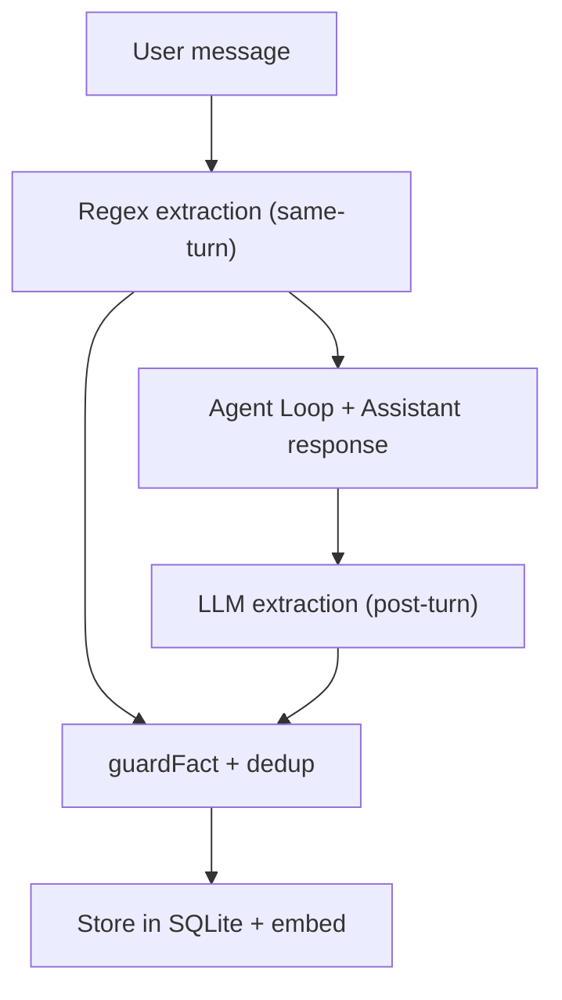

Spaceduck has a three-tier memory system:

1. **Short-term** — full conversation history in SQLite, with token-budgeted context windows and automatic compaction
2. **Long-term (facts)** — durable personal facts extracted from conversations
3. **Vector embeddings** — semantic similarity search for cross-conversation recall

## How facts are extracted

After every assistant response, Spaceduck runs a two-stage extraction pipeline:

1. **Regex extraction** (deterministic, same-turn) — pattern-matches identity facts like "My name is Peter" or "I live in Copenhagen" and stores them immediately, before the next context build
2. **LLM extraction** (best-effort, post-response) — the chat model extracts additional facts from the conversation

Regex extraction currently covers English and Danish. LLM extraction works in any language your chat model understands.

## Slots vs slotless facts

Facts come in two types:

**Slot facts** have a specific identity category:

| Slot | Example | Behavior |
|------|---------|----------|
| `name` | "User's name is Peter" | Only one active at a time |
| `age` | "User is 32 years old" | Only one active at a time |
| `location` | "User lives in Tokyo" | Only one active at a time |
| `preference` | "User prefers dark mode" | Multiple can coexist |

**Slotless facts** are general observations without a specific category:

- "User works in software engineering"
- "User has a dog named Max"
- "User mentioned a trip to Paris last summer"

Slot facts use transactional upsert — when you say "My name is Peter" after previously saying "My name is John", the John fact is deactivated and Peter becomes the active fact.

## Corrections win

When a slot value changes, Spaceduck:

1. Deactivates the old slot fact
2. Deactivates any slotless facts that reference the old value (e.g., "User's name is John" as a turn-flush fact)
3. Stores the new slot fact as active

This is **value-based deactivation** — it works regardless of language because it matches the old value in fact content, not language-specific patterns.

<Note>
Example: You say "My name is John", then later "Actually, my name is Peter". Spaceduck deactivates the `name=John` slot fact **and** any slotless facts containing "John" that were extracted as turn-flush observations.
</Note>

## Contamination guard

Spaceduck enforces a strict rule: **assistant-generated text can never overwrite your identity.**

- Regex-based identity extraction runs only on user-authored messages
- Even if the LLM says "I'm curious about that", the word "curious" can never end up as your name
- A secondary guard blocks any identity slot upsert where the source message role is not `user`

The memory firewall (`guardFact`) also rejects:
- Questions (not facts)
- Noisy or too-short content
- "Unknown" / "not set" / "not provided" poison values from LLM responses

## How recall works

When you ask a question, Spaceduck searches long-term memory using hybrid scoring:

1. **Vector search** — cosine similarity between your query embedding and stored fact embeddings
2. **Keyword search** — FTS5 BM25 full-text search
3. **Reciprocal Rank Fusion** — combines both result lists into a single ranking
4. **Recency decay** — newer facts score slightly higher
5. **Expiry filter** — facts older than the configured threshold are excluded

If embeddings are disabled (semantic recall toggled off), Spaceduck falls back to keyword search only.

<Info>
Recall quality depends heavily on your embedding model. Models like `nomic-embed-text-v1.5` support 100+ languages and work well for multilingual memory.
</Info>

## Configuration

Recall behavior is configured in **Settings > Memory**:

| Setting | What it controls |
|---------|-----------------|
| **Semantic recall** toggle | Enables/disables vector search |
| **Provider** | Which embedding model to use |
| **Dimensions** | Must match the embedding model |

Chat-level settings that affect memory:

| Setting | What it controls |
|---------|-----------------|
| **System prompt** | Can include instructions about what to remember |
| **Token budget** | How much conversation history fits in context |
