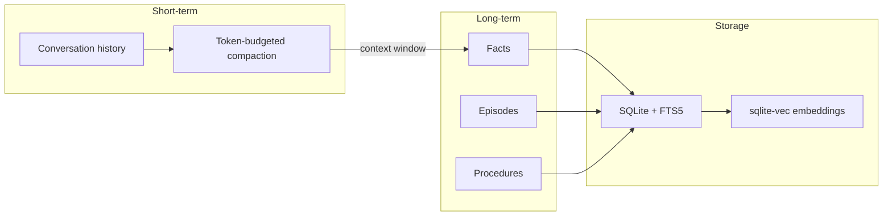
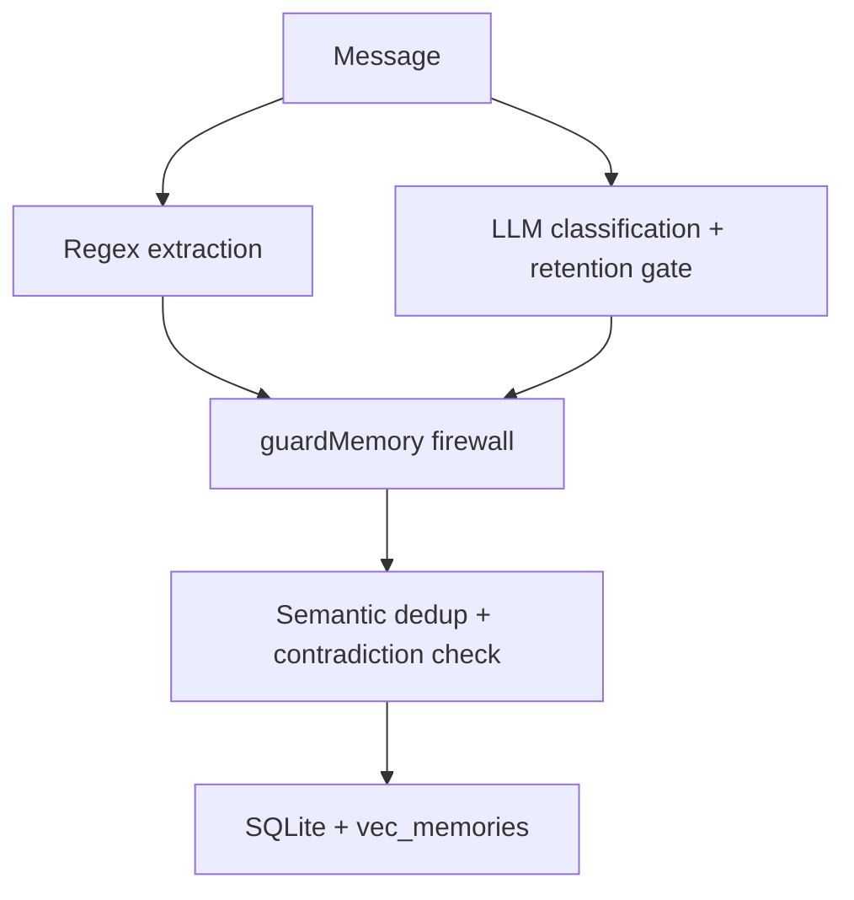
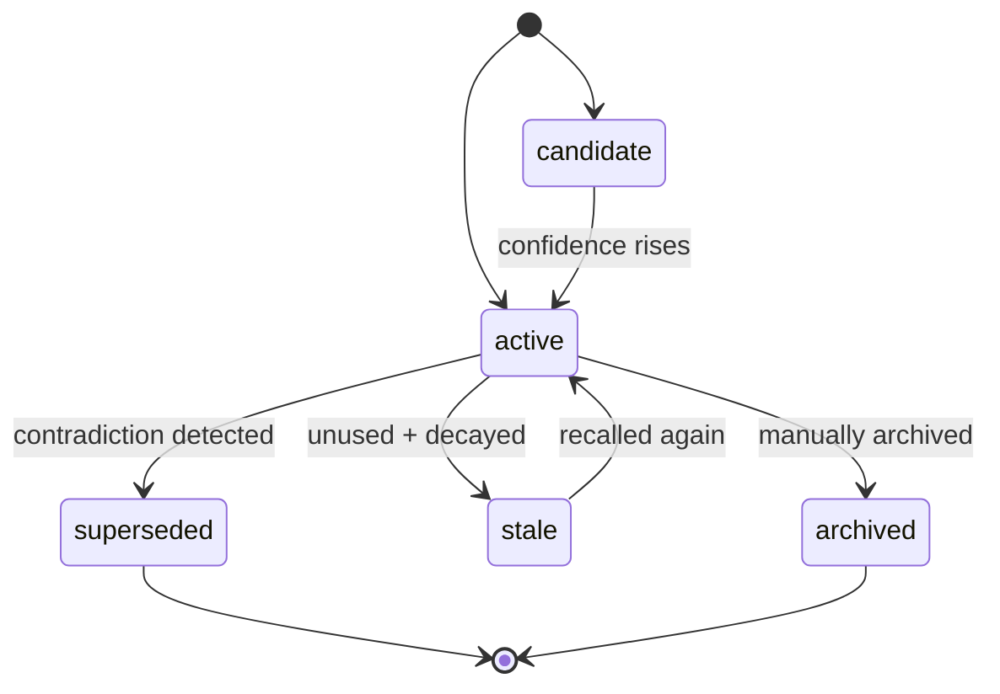

Spaceduck uses a layered memory system. Short-term memory lives inside each conversation. Long-term memory persists across conversations and is automatically extracted, classified, and deduplicated.

## Layers

| Layer | What it stores | Lifetime |
|-------|---------------|----------|
| **Conversation history** | Full message log per conversation | Session (compacted to fit token budget) |
| **Facts** | Stable truths, preferences, identities | Permanent until superseded |
| **Episodes** | User-caused decisions, milestones, notable events | Permanent, decays over time |
| **Procedures** | Behavioral instructions, workflows, hard constraints | Permanent |

## Extraction pipeline

After every message, Spaceduck runs a two-stage extraction pipeline asynchronously (never blocks the response):

1. **Regex extraction** -- pattern-matches identity facts ("My name is...", "I live in...") for immediate capture
2. **LLM classification** -- the chat model extracts and classifies memories with structured output

Each candidate is assigned:
- **Kind**: fact, episode, or procedure
- **Importance**: trivial / standard / significant / core / critical
- **Confidence**: speculative / likely / stated / certain
- **Tags**: 1-4 lowercase topic labels
- **Retention decision**: store or reject (with reason)

A deterministic "steel gate" validates the LLM output before anything touches the database.

## Semantic dedup and contradiction detection

When a new memory is stored, it is embedded and compared against existing memories using cosine similarity:

| Cosine range | Action |
|-------------|--------|
| >= 0.92 | **Near-duplicate** -- skip (touch `lastSeenAt` on existing) |
| 0.60 -- 0.92 | **Same topic** -- ask LLM arbiter if contradiction or consistent |
| < 0.60 | **Different topic** -- store normally |

If the LLM arbiter says "contradiction", the old memory is marked `superseded` and the new one becomes active. If "consistent", both coexist.

This handles corrections like "I live in Paris" followed by "I live in Tokyo" -- the location change is detected and the old fact is retired.

## Recall

When building context for a response, Spaceduck retrieves memories using hybrid scoring:

1. **Vector search** -- cosine similarity between query embedding and stored memory embeddings
2. **Keyword search** -- FTS5 BM25 full-text search
3. **Reciprocal Rank Fusion (RRF)** -- merges both result lists into a single ranking
4. **Post-fusion multipliers** -- importance, confidence, recency decay, and scope boost

Memories are scoped: thread > project > global. Thread-scoped memories decay faster (30-day half-life vs 90-day for global).

## Procedure subtypes

Procedures are further classified to control injection priority:

| Subtype | Example | Injection |
|---------|---------|-----------|
| **constraint** | "Never commit secrets to git" | Always injected (top priority) |
| **workflow** | "Run tests before deploying" | Injected when topic matches |
| **behavioral** | "Use a friendly tone" | Injected when relevant |

## Memory status lifecycle

## Configuration

Memory settings live in **Settings > Memory**:

| Setting | What it controls |
|---------|-----------------|
| **Memory** toggle | Enables/disables long-term memory |
| **Semantic recall** toggle | Enables/disables vector search |
| **Embedding provider** | Which embedding model to use |
| **Dimensions** | Must match the embedding model |
