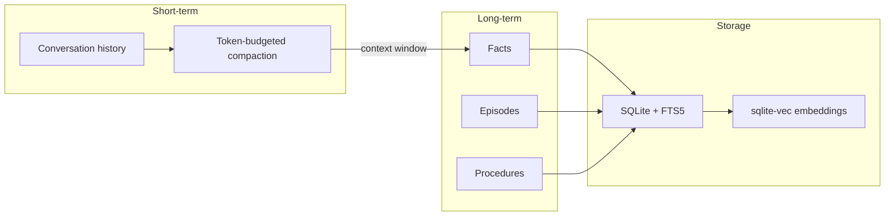
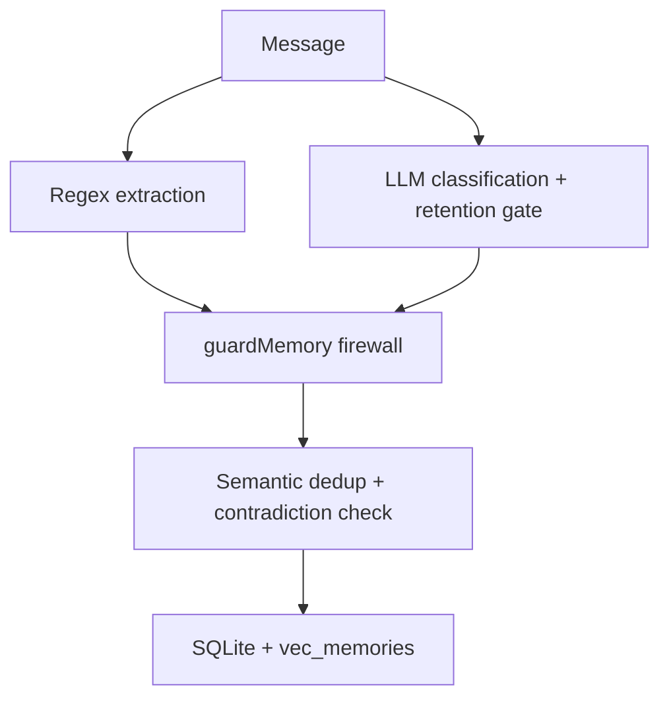
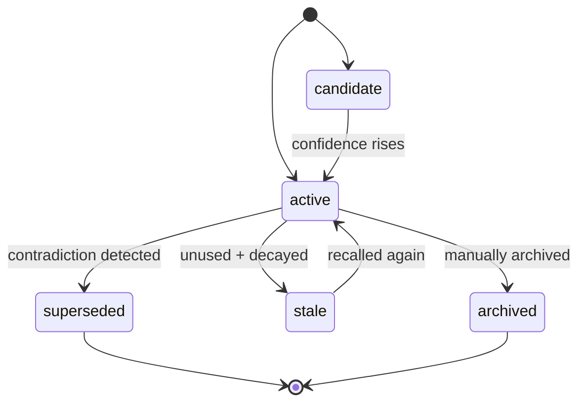

spaceduck uses a layered memory system. Short-term memory lives inside each conversation. Long-term memory persists across conversations and is automatically extracted, classified, and deduplicated.

## Layers

```mermaid
flowchart LR
    subgraph shortTerm [Short-term]
        Conv["Conversation history"]
        Compact["Token-budgeted compaction"]
    end

    subgraph longTerm [Long-term]
        Facts["Facts"]
        Episodes["Episodes"]
        Procedures["Procedures"]
    end

    subgraph storage [Storage]
        SQLite["SQLite + FTS5"]
        Vec["sqlite-vec embeddings"]
    end

    Conv --> Compact
    Compact -->|context window| Facts
    Facts --> SQLite
    Episodes --> SQLite
    Procedures --> SQLite
    SQLite --> Vec
```

| Layer | What it stores | Lifetime |
|-------|---------------|----------|
| **Conversation history** | Full message log per conversation | Session (compacted to fit token budget) |
| **Facts** | Stable truths, preferences, identities | Permanent until superseded |
| **Episodes** | User-caused decisions, milestones, notable events | Permanent, decays over time |
| **Procedures** | Behavioral instructions, workflows, hard constraints | Permanent |

## Extraction pipeline

After every message, spaceduck runs a two-stage extraction pipeline asynchronously (never blocks the response):

1. **Regex extraction** -- pattern-matches identity facts ("My name is...", "I live in...") for immediate capture
2. **LLM classification** -- the chat model extracts and classifies memories with structured output

Each candidate is assigned:
- **Kind**: fact, episode, or procedure
- **Importance**: trivial / standard / significant / core / critical
- **Confidence**: speculative / likely / stated / certain
- **Tags**: 1-4 lowercase topic labels
- **Retention decision**: store or reject (with reason)

A deterministic "steel gate" validates the LLM output before anything touches the database.

```mermaid
flowchart TD
    Msg["Message"]
    Regex["Regex extraction"]
    LLM["LLM classification + retention gate"]
    Guard["guardMemory firewall"]
    Dedup["Semantic dedup + contradiction check"]
    Store["SQLite + vec_memories"]

    Msg --> Regex
    Msg --> LLM
    Regex --> Guard
    LLM --> Guard
    Guard --> Dedup
    Dedup --> Store
```

## Semantic dedup and contradiction detection

When a new memory is stored, it is embedded and compared against existing memories using cosine similarity:

| Cosine range | Action |
|-------------|--------|
| >= 0.92 | **Near-duplicate** -- skip (touch `lastSeenAt` on existing) |
| 0.60 -- 0.92 | **Same topic** -- ask LLM arbiter if contradiction or consistent |
| < 0.60 | **Different topic** -- store normally |

If the LLM arbiter says "contradiction", the old memory is marked `superseded` and the new one becomes active. If "consistent", both coexist.

This handles corrections like "I live in Paris" followed by "I live in Tokyo" -- the location change is detected and the old fact is retired.

## Recall

When building context for a response, spaceduck retrieves memories using hybrid scoring:

1. **Vector search** -- cosine similarity between query embedding and stored memory embeddings
2. **Keyword search** -- FTS5 BM25 full-text search
3. **Reciprocal Rank Fusion (RRF)** -- merges both result lists into a single ranking
4. **Post-fusion multipliers** -- importance, confidence, recency decay, and scope boost

Memories are scoped: thread > project > global. Thread-scoped memories decay faster (30-day half-life vs 90-day for global).

## Procedure subtypes

Procedures are further classified to control injection priority:

| Subtype | Example | Injection |
|---------|---------|-----------|
| **constraint** | "Never commit secrets to git" | Always injected (top priority) |
| **workflow** | "Run tests before deploying" | Injected when topic matches |
| **behavioral** | "Use a friendly tone" | Injected when relevant |

## Memory status lifecycle

```mermaid
stateDiagram-v2
    [*] --> candidate
    [*] --> active
    candidate --> active: confidence rises
    active --> superseded: contradiction detected
    active --> stale: unused + decayed
    active --> archived: manually archived
    stale --> active: recalled again
    superseded --> [*]
    archived --> [*]
```

## Memory isolation

When the [scheduler](/concepts/scheduler) runs tasks autonomously, their memory writes carry provenance so they don't pollute interactive recall.

Each memory record stores a `taskId` (which task wrote it) and optionally a `skillId` (which skill was active). This enables:

- **Scoped recall** -- scheduled tasks see their own memories plus global ones, not noise from other tasks. Controlled via `excludeTaskMemories` and `sourceTaskId` filters.
- **Write budgets** -- each task is limited to `maxMemoryWrites` (default 10). A counting proxy wraps the store and silently drops writes once the limit is reached.
- **Cascading purge** -- when a [skill](/concepts/skills) is uninstalled, all memories tagged with its `skillId` are deleted automatically.
- **Injection detection** -- all content passes through `detectInjection` before storage. Task-sourced content uses strict mode (single pattern match rejects); user input uses relaxed mode (2+ matches required).

See [Security](/concepts/security) for the full defense-in-depth model.

## Memory viewer

The memory viewer lets you inspect, search, and manage everything Spaceduck remembers. Access it from the **Brain icon** in the sidebar.

- **Browse** all stored memories (facts, episodes, procedures) with filters for kind, status, and scope
- **Search** using the same hybrid retrieval pipeline (vector + FTS + RRF) the agent uses internally
- **Delete** individual memories that are wrong, outdated, or no longer useful
- **Provenance** each card shows where the memory came from: which skill wrote it, which task created it, and the source type (user message, assistant, tool result, etc.)

### Memory API

The viewer is backed by authenticated HTTP endpoints on the gateway:

| Method | Endpoint | Description |
|--------|----------|-------------|
| `GET` | `/api/memories` | List memories with optional filters (`kinds`, `status`, `scope`, `limit`) |
| `GET` | `/api/memories/search?q=...` | Hybrid search (same recall pipeline as the agent) |
| `GET` | `/api/memories/:id` | Get a single memory by ID |
| `DELETE` | `/api/memories/:id` | Permanently delete a memory |

## Configuration

Memory settings live in **Settings > Memory**:

| Setting | What it controls |
|---------|-----------------|
| **Memory** toggle | Enables/disables long-term memory |
| **Semantic recall** toggle | Enables/disables vector search |
| **Embedding provider** | Which embedding model to use |
| **Dimensions** | Must match the embedding model |
