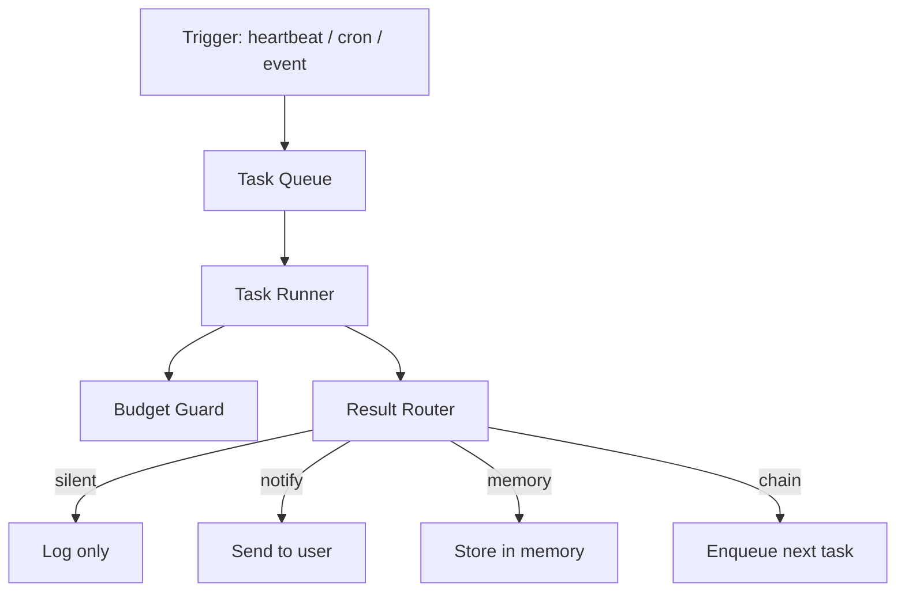

Spaceduck can act without being asked. The scheduler lets the assistant wake up on a timer, run a task, and decide what to do with the result — notify you, update memory, chain to another task, or stay silent.

Every task runs within a budget. No budget, no execution.

## How it works

Tasks are queued with a priority (0–9) and executed up to a configurable concurrency limit. If a task targets a specific conversation, it acquires a lock to prevent state corruption from parallel runs.

## Task types

| Type | Trigger | Example |
|------|---------|---------|
| **Heartbeat** | Repeating interval | Check inbox every 5 minutes |
| **Scheduled** | Cron expression | Summarize daily news at 8am |
| **Event** | EventBus signal | React when a file changes |
| **Workflow** | Chained from another task | Research → Summarize → Notify |

## Budget enforcement

Every task has per-run limits. If you don't set them, defaults apply.

| Limit | Default | What happens at 100% |
|-------|---------|---------------------|
| Tokens | 50,000 | Task aborted |
| Cost | $0.50 | Task aborted |
| Wall clock | 5 minutes | Task aborted |
| Tool calls | 10 | Task aborted |

A warning fires at 80%. Budget-exceeded tasks go straight to the dead letter queue — no retries.

### Global limits

On top of per-task budgets, global daily and monthly ceilings prevent runaway spend across all tasks.

| Limit | Default |
|-------|---------|
| Daily | $5.00 |
| Monthly | $50.00 |

When a global limit is hit, the scheduler pauses. No more tasks run until the next period or you manually resume.

## Retries and dead letter

Failed tasks are retried with exponential backoff (default: up to 3 attempts). If all retries are exhausted, the task moves to the dead letter queue where you can inspect the error and retry manually.

## REST API

| Method | Path | Description |
|--------|------|-------------|
| `POST` | `/api/tasks` | Create a task |
| `GET` | `/api/tasks` | List tasks |
| `GET` | `/api/tasks/:id` | Get task details |
| `DELETE` | `/api/tasks/:id` | Cancel a task |
| `POST` | `/api/tasks/:id/retry` | Retry a dead-lettered task |
| `GET` | `/api/tasks/budget` | Current spend and scheduler status |

## Configuration

Scheduler settings live in `spaceduck.config.json5` under the `scheduler` key. All settings hot-apply — no restart needed.

| Setting | Default | What it controls |
|---------|---------|-----------------|
| `enabled` | `false` | Turns the scheduler on/off |
| `heartbeatIntervalMs` | `60000` | How often the scheduler checks for due tasks |
| `maxConcurrentTasks` | `3` | Max tasks running in parallel |

Budget defaults and retry settings are also configurable. See **Settings > Scheduler** once enabled.

<Warning>
The scheduler is opt-in. It does nothing until you set `scheduler.enabled: true` and create at least one task.
</Warning>
