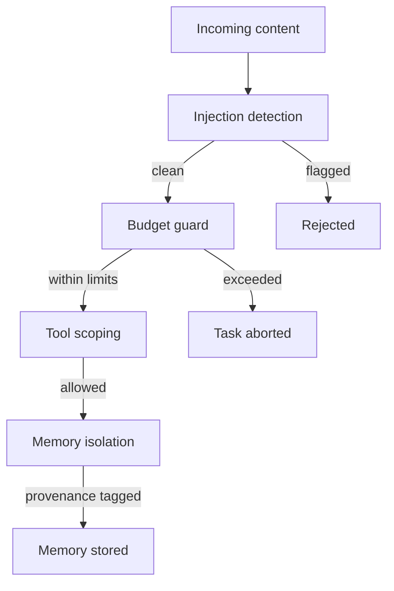

spaceduck treats security as a runtime default, not a bolt-on. Budget enforcement, memory isolation, injection detection, and skill sandboxing are built into the scheduler and agent loop. Nothing runs without limits.

## Defense in depth

Each layer catches a different class of problem. A malicious skill that passes the scanner still hits tool scoping. A runaway task that burns tokens still hits the budget guard. Memory written by one task doesn't leak into another's context.

## Injection detection

The `detectInjection` function runs on all content before it enters the memory store. It catches prompt injection, role hijacking, and XML tag injection patterns.

Two modes, based on trust level:

| Mode | When used | Threshold |
|------|-----------|-----------|
| **Strict** | Task-sourced memories (autonomous agent output) | Single pattern match rejects |
| **Relaxed** | User-typed input (interactive conversation) | 2+ pattern matches required |

### Pattern categories

| Category | Examples |
|----------|---------|
| Role injection | `[INST]`, `<<SYS>>`, `<system>`, `assistant:` |
| Instruction override | "ignore previous instructions", "new instructions:" |
| XML tag injection | `<tool_call>`, `<function>`, `<tool_result>` |
| Prompt framing | "you are now a...", "from now on you..." |

Extra patterns can be loaded from config without a code deploy.

## Memory isolation

Autonomous tasks run on their own, often at night. Their memory writes should not pollute interactive recall.

### Provenance

Every memory record carries its source:

| Field | Set when | Purpose |
|-------|----------|---------|
| `taskId` | Memory written during a scheduled task | Tracks which task produced it |
| `skillId` | Memory written while a skill is active | Tracks which skill produced it |

### Recall filtering

When building context, the runner can filter memories by provenance:

| Filter | Effect |
|--------|--------|
| `excludeTaskMemories` | Omits all task-sourced memories from recall |
| `sourceTaskId` | Only includes memories from a specific task |

By default, scheduled tasks run with scoped recall (their own task's memories + globally shared memories) so they don't pick up noise from other tasks.

### Memory write budget

Each task has a `maxMemoryWrites` limit (default: 10). A counting proxy wraps the memory store during task execution. Once the limit is reached, writes are silently dropped and logged. This prevents a runaway cron job from flooding long-term memory.

### Cascading purge

When a skill is uninstalled, all memories tagged with its `skillId` are deleted from the store. No manual cleanup needed.

## Budget enforcement

Budgets are enforced at two levels:

### Per-task

| Limit | Default | What happens |
|-------|---------|-------------|
| Tokens | 50,000 | Task aborted |
| Cost | $0.50 | Task aborted |
| Wall clock | 5 min | Task aborted |
| Tool calls | 10 | Task aborted |
| Memory writes | 10 | Writes dropped |

A warning fires at 80% of each limit. Budget-exceeded tasks are not retried.

### Global

| Limit | Default |
|-------|---------|
| Daily | $5.00 |
| Monthly | $50.00 |

When a global limit is hit, the scheduler pauses all tasks until the next period or manual resume.

Cost tracking is cache-aware. Providers that return cache read/write token counts get accurate pricing via per-model rate lookup. Unknown models fall back to a conservative default rate.

## Skill security

Skills go through two layers of defense:

### 1. Static scanner (install time)

The security scanner runs pattern matching on skill instructions before they enter the registry. See [Skills > Security scanner](/concepts/skills#security-scanner) for the full rule set.

### 2. Tool scoping (run time)

Even if a skill passes the scanner, it can only use tools it explicitly declares in `toolAllow`. A skill that says "read ~/.ssh/id_rsa" in its instructions but only has `toolAllow: [web_search]` will never have filesystem access. See [Skills > Tool scoping](/concepts/skills#tool-scoping).

The scanner catches obvious attacks. Tool scoping prevents everything else. Both must pass for a skill to do damage.
