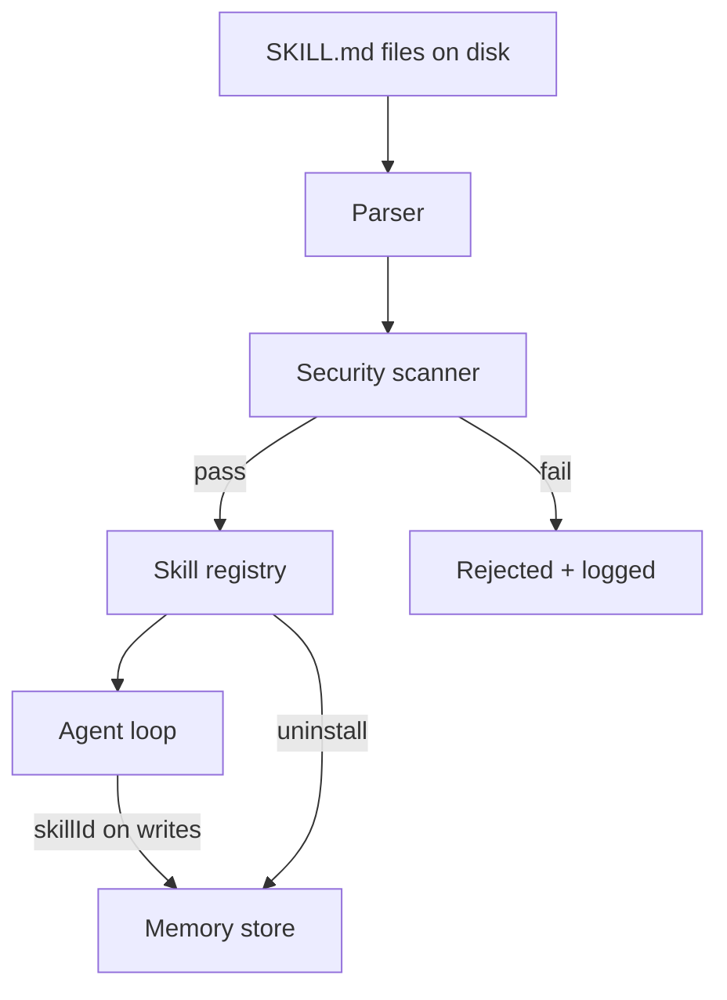
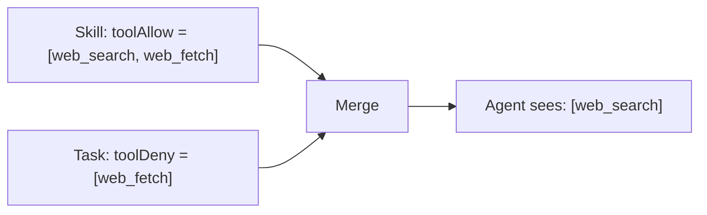

Skills are markdown files that teach spaceduck new behaviors. Each skill is a `SKILL.md` file with YAML frontmatter (metadata) and a markdown body (instructions for the LLM). Skills are loaded at runtime without restarting the gateway.

## How it works



When the gateway starts, it reads all `SKILL.md` files from configured paths, parses each one, runs the security scanner, and registers those that pass. Skills that fail the scan are rejected with a log entry explaining why.

## SKILL.md format

A skill file has two parts: YAML frontmatter and a markdown body.

```yaml SKILL.md
---
name: daily-summary
description: Summarize the day's conversations and store key takeaways.
toolAllow: [web_search]
maxTokens: 10000
maxCostUsd: 0.05
---

# Daily Summary

You are reviewing today's conversations to extract durable insights.

1. Identify facts, preferences, and decisions.
2. Ignore small talk and transient questions.
3. Write a concise one-sentence summary for each takeaway.
```

### Required fields

| Field | Type | Description |
|-------|------|-------------|
| `name` | string | Unique identifier for the skill (lowercase, hyphenated) |
| `description` | string | What the skill does and when to use it |

### Optional fields (spaceduck extensions)

| Field | Type | Description |
|-------|------|-------------|
| `version` | string | Semantic version |
| `author` | string | Skill author |
| `toolAllow` | string[] | Only these tools are available to the skill |
| `toolDeny` | string[] | These tools are blocked for the skill |
| `maxTokens` | number | Token budget per run |
| `maxCostUsd` | number | Dollar ceiling per run |
| `maxWallClockMs` | number | Wall-clock timeout |
| `maxToolCalls` | number | Max tool invocations |
| `maxMemoryWrites` | number | Max memory writes per run |

### OpenClaw compatibility

spaceduck parses OpenClaw's SKILL.md format natively. Unknown frontmatter fields (like `tools`, `model`, or `provider`) are silently preserved, never rejected. This means existing OpenClaw skills work out of the box.

## Security scanner

Every skill is scanned before it enters the registry. The scanner checks four categories:

| Category | Severity | Examples |
|----------|----------|---------|
| **Injection patterns** | Critical | `[INST]`, `<system>`, role injection |
| **Prompt overrides** | Critical | "ignore your system prompt", "you are no longer..." |
| **Dangerous tool refs** | Critical / Warning | `exec()`, `rm -rf`, `curl | bash` |
| **Budget evasion** | Warning | "retry indefinitely", "ignore the budget limit" |

Skills with **critical** findings are rejected. Skills with only **warning** findings are loaded but flagged in logs.

<Note>
Dangerous tool references are downgraded from critical to warning when the skill declares an explicit `toolAllow` list, because tool scoping prevents the referenced tools from being available at runtime.
</Note>

<Warning>
The scanner is static pattern matching only. It catches obvious attacks but not semantic ones (e.g. "read the file at ~/.ssh/id_rsa"). Tool scoping is the real enforcement layer. See [Security](/concepts/security) for the full defense-in-depth model.
</Warning>

## Tool scoping

Skills declare which tools they need via `toolAllow`. When a task runs with a skill, the agent loop only sees the tools that both the skill and the task permit.

The merge logic is:
- **Allow lists**: intersection (skill declares what it needs, task can further restrict)
- **Deny lists**: union (both contribute)



A skill that declares `toolAllow: [web_search]` can never access the browser, file system, or shell, regardless of what its instructions say.

## Memory attribution

When a skill writes to memory (via the `memory_update` result route), the memory record includes both `taskId` and `skillId` in its provenance. This enables:

- Filtering memories by skill during recall
- Cascading purge on skill uninstall (all memories written by the skill are deleted)
- Auditing which skill produced which memories

## First-party skills

spaceduck ships with three built-in skills in the `skills/` directory:

| Skill | Type | What it does |
|-------|------|-------------|
| `daily-summary` | Scheduled | Summarizes the day's conversations, stores key takeaways |
| `inbox-triage` | Event-driven | Categorizes incoming messages by urgency |
| `memory-hygiene` | Scheduled | Finds contradictory, stale, or duplicate memories |

Each has a conservative budget and an empty `toolAllow` (no tool access).

## Configuration

Skill settings live in `spaceduck.config.json5` under the `skills` key. All settings hot-apply.

| Setting | Default | Description |
|---------|---------|-------------|
| `paths` | `["./skills"]` | Directories to scan for SKILL.md files |
| `enabled` | `[]` | Skill IDs to enable (empty = all loaded skills enabled) |
| `autoScan` | `true` | Run the security scanner on load |

<Warning>
Setting `autoScan: false` disables the security scanner entirely. Only do this in development.
</Warning>
