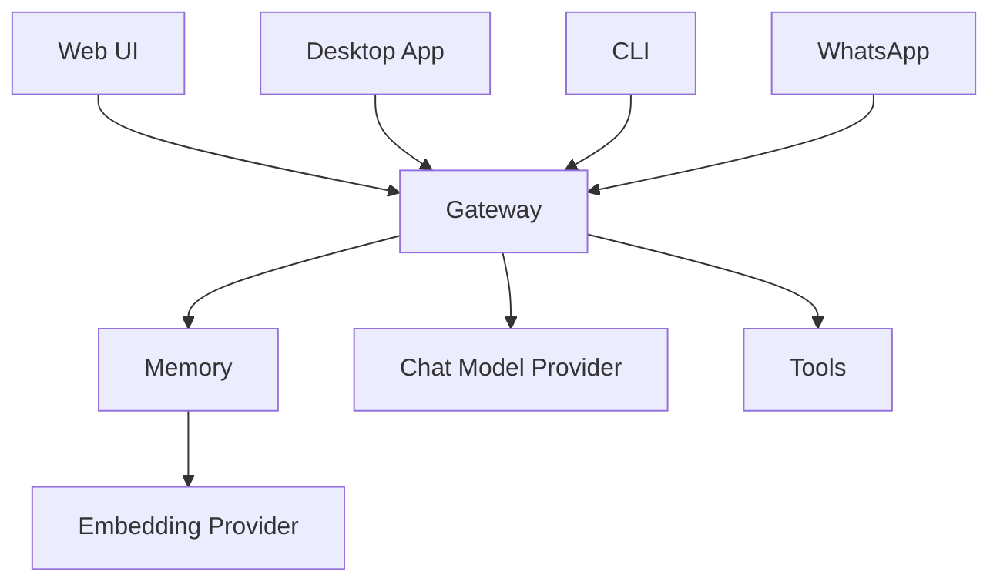

Spaceduck is a local-first AI assistant with persistent memory.

It remembers what you've said across conversations, acts on your behalf with real tools, and runs entirely on your machine. No agent frameworks, no orchestration wrappers — every layer is handwritten TypeScript.

## Why Spaceduck

<CardGroup cols={2}>
  <Card icon="brain" title="Persistent memory">
    Hybrid recall (vector + keyword) finds what you said even when you don't use the same words. Facts are extracted eagerly after every response.
  </Card>
  <Card icon="shuffle" title="Provider freedom">
    Swap between local models (llama.cpp, LM Studio) and cloud providers (Bedrock, Gemini, OpenRouter) from the Settings UI — no restart required.
  </Card>
  <Card icon="wrench" title="Agentic tools">
    Web search, browser automation, document scanning, and HTTP fetch. The agent loop chains tool calls automatically.
  </Card>
  <Card icon="comments" title="Multi-channel">
    Web UI, Desktop app (Tauri), WhatsApp, and CLI. Same memory, same tools, any surface.
  </Card>
</CardGroup>

## How it works

Spaceduck runs a local gateway server that connects your chosen AI model to persistent memory, tools, and channels.

Every conversation flows through the gateway. The gateway manages context budgets, extracts facts into long-term memory, embeds them for semantic recall, and orchestrates tool calls.

## Key features

- **Typed memory** — facts, episodes, and procedures with semantic dedup and automatic contradiction detection
- **Hybrid recall** — Reciprocal Rank Fusion combining vector cosine similarity and FTS5 BM25, with recency decay
- **Self-correcting** — when you change a fact ("I moved to Tokyo"), the old one is automatically superseded
- **Hot-swap providers** — change your chat model or embedding model at runtime from the Settings UI or CLI
- **Two-server pattern** — run chat and embeddings on separate endpoints (local, cloud, or mixed)
- **Eager extraction** — memories are classified and stored after every turn, not only at compaction

## Next steps

<CardGroup cols={2}>
  <Card icon="rocket" href="/quickstart" title="Quickstart">
    Get Spaceduck running and send your first message in under 5 minutes.
  </Card>
  <Card icon="server" href="/providers/overview" title="Model Providers">
    Choose and configure your chat and embedding model providers.
  </Card>
</CardGroup>