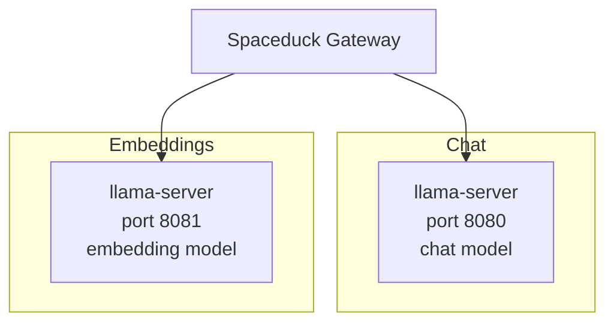

Spaceduck has two independent model subsystems:

- **Chat model** — generates responses in conversations
- **Embedding model** — powers semantic memory recall

You configure each independently. They can use the same provider, different providers, or even a mix of local and cloud.

## Local vs cloud

<CardGroup cols={2}>
  <Card icon="house" title="Local">
    **llama.cpp** and **LM Studio** run models on your hardware. No API keys, no data leaves your machine. Requires downloading model files and enough RAM/VRAM.
  </Card>
  <Card icon="cloud" title="Cloud">
    **Bedrock**, **Gemini**, and **OpenRouter** run models on remote infrastructure. Requires an API key. No local hardware requirements beyond the gateway itself.
  </Card>
</CardGroup>

## Available providers

### Local

| Provider                         | Chat | Embeddings            | Default URL                |
| -------------------------------- | ---- | --------------------- | -------------------------- |
| [llama.cpp](/providers/llamacpp) | Yes  | Yes (separate server) | `http://127.0.0.1:8080/v1` |
| [LM Studio](/providers/lmstudio) | Yes  | Yes                   | `http://localhost:1234/v1` |

### Cloud

| Provider                            | Chat | Embeddings         | Auth         |
| ----------------------------------- | ---- | ------------------ | ------------ |
| [AWS Bedrock](/providers/bedrock)   | Yes  | Yes (Titan / Nova) | Bearer token |
| [Google Gemini](/providers/gemini)  | Yes  | Yes                | API key      |
| [OpenRouter](/providers/openrouter) | Yes  | No                 | API key      |

## The two-server pattern

A common local setup runs chat and embeddings on separate servers:

This works because chat and embeddings are independent subsystems. Configure them separately in Settings:

- **Settings \> Chat** — provider, base URL, model, API key
- **Settings \> Memory** — embedding provider, base URL, model, dimensions

The two-server pattern also works with cloud providers (e.g., llama.cpp for chat, Bedrock for embeddings) or any combination.

## Hot-swapping

Chat provider changes (provider, model, base URL, system prompt) take effect immediately — no gateway restart needed.

Embedding provider changes require a restart and may invalidate existing vector memory if the model or dimensions change.

<Warning>
  Changing your embedding model or dimensions will make previously stored vectors incompatible. You'll need to rebuild your vector memory after switching.
</Warning>

## Choosing a provider

| Priority                   | Recommended                           |
| -------------------------- | ------------------------------------- |
| Privacy first, no cloud    | llama.cpp or LM Studio                |
| Best quality, cost is fine | Bedrock (Claude, Nova) or Gemini      |
| Widest model selection     | OpenRouter                            |
| Simple local setup         | LM Studio (built-in model browser)    |
| Maximum control            | llama.cpp (direct llama-server flags) |